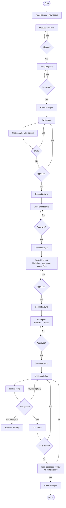

# Code Factory Instructions

This workspace is a code factory. Source material is in `domain-knowledge/`. Unless otherwise noted, Anvil paths below are relative to the active workspace `anvil-development/v<version-number>/`. Follow these sequential phases, reviewing with me and committing+syncing to remote after each one before moving on.

## Phases

1. **Proposal** (`docs/proposal.md`) — Discuss the domain knowledge with me until we align, then write the proposal. Commit when approved.

2. **Spec** (`docs/spec.md`) — Write a detailed software requirements specification. Do a gap analysis against the proposal and fix any drift. Commit when approved.

3. **Architecture** (`docs/architecture.md`) — Derive a high-level architectural document (components, interactions) from the spec and proposal. This is a living document. Commit when approved.

4. **Blueprint** (`docs/blueprint.md`) — Write a detailed code blueprint in Markdown only (no generated source files yet), derived from the spec and architecture. Commit when approved.

5. **Plan** (`docs/plan.md`) — Write a phased implementation plan with slices. Each slice must: enforce no drift from blueprint/architecture/spec, include unit, integration, and end-to-end tests, and follow best practices. Commit when approved.

6. **Implementation** — Execute the plan slice by slice:
   - Implement code with no drift from blueprint, architecture, and spec.
   - Run all tests at the end of each slice. If tests fail, fix and retry up to 5 times before asking for help.
   - Verify no drift after each slice, then commit and sync.
   - After all slices, do a final review of the full codebase, confirm all tests pass, and commit.

## Workflow Diagram

## Conventions & Rules

### Versioned Development Scope
- The active Anvil workspace is `anvil-development/v<version-number>/`.
- Use that workspace's `docs/`, `src/`, `tests/`, and `logs/` directories for all Anvil artifacts.
- Keep top-level `docs/`, `src/`, `tests/`, and `logs/` for repository-level material unless a task explicitly targets Anvil.
- Use the project root for repository-wide config and the active workspace for Anvil-specific config and artifacts.

### Versioning & Documentation
Doc style follows the release type so each version's `docs/` stay concise without losing context:
- **Patch / fix release** (e.g. v0.1.1): write **deltas** that reference the previous version's docs; do not reproduce unchanged baseline content.
- **Minor / feature release** (e.g. v0.2.0): proposal and plan stay delta; **spec and architecture become self-contained snapshots** that fold all prior deltas back in and reset the baseline (consolidation point — prevents long delta chains).
- **Major release** (e.g. v1.0.0): all docs are self-contained.
- Per-document trend regardless of release: **proposal and plan are always version-scoped (delta)**; **architecture is a living document and trends to current-state/cumulative**; spec and blueprint are delta for fixes, snapshot for features.

### Branching Strategy
- Work on `main` directly. Each phase (proposal, spec, architecture, etc.) is a separate commit gate.
- Do not create feature branches unless explicitly requested.

### Drift Definition
**Drift** occurs when:
- A feature exists in code but is not in the spec or architecture.
- A component/interface exists in code but not in the blueprint.
- Code structure or naming contradicts the architecture document.
- A requirement from the spec is missing or partially implemented.

### Review Checkpoints
- Wait for explicit approval at each gate (after Proposal, Spec, Architecture, Blueprint, Plan).
- Do not proceed to the next phase without your approval.
- If you do not respond within a reasonable time, ask for clarification before proceeding.

### Commit Message Format
Use atomic commits with pattern: `[PHASE] Short description`
- Examples:
  - `[PROPOSAL] Initial code factory proposal`
  - `[SPEC] Software requirements specification`
  - `[ARCHITECTURE] High-level system design`
  - `[BLUEPRINT] Detailed code structure`
  - `[PLAN] Implementation plan with slices`
  - `[IMPL-S1] Implement slice 1: Core data models`
  - `[IMPL-S2] Implement slice 2: API handlers`

### Domain-Knowledge Updates
If new requirements emerge during implementation that contradict the original domain knowledge:
- Update `domain-knowledge/` with the new insight.
- Flag it in the PR description for review.
- Do not re-run upstream phases unless you request it.
- Document the delta clearly so intent is preserved.

### Implementation Logging
- Maintain the implementation log with a detailed journal of all implementation work.
- Record for each slice:
  - Slice name and objective
  - Files created/modified
  - Test results (pass/fail, which tests failed)
  - Issues encountered and fixes applied (include attempt count)
  - Time taken and any blockers
  - Final status (passed, passed after N retries, escalated)
- After each slice passes all tests:
  - Update the plan artifact to mark the slice as ✅ **COMPLETED**
  - Add brief notes on what was done and any lessons learned
  - Include the git commit hash for the slice
