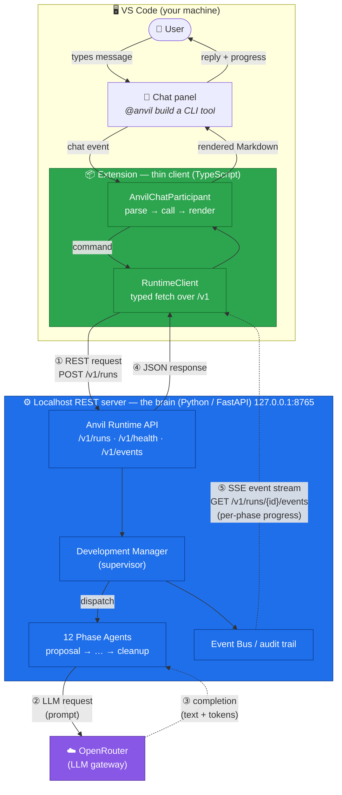
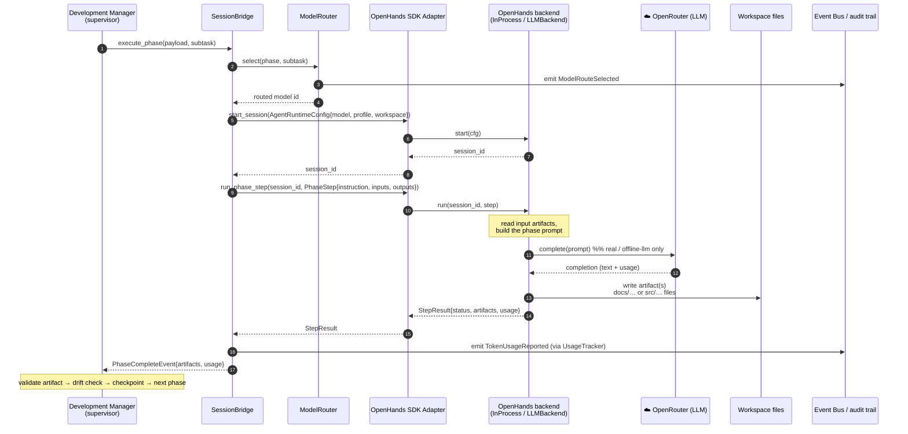

# Anvil Data Flow — chat → runtime → LLM

Anvil splits cleanly into three layers: the **VS Code chat UI**, a **thin-client
extension** (TypeScript), and the **localhost REST server** (Python/FastAPI) that
does all the real work. The extension holds no state and makes no LLM calls of
its own — it translates each chat message into an HTTP request, then renders the
response back into the chat.

## End-to-end flow

## How to read it

- **Solid arrows** — request/response calls (REST client → server, and each
  phase → the LLM).
- **Dotted arrows** — responses that arrive asynchronously: the LLM completion
  back to a phase (**③**), and the one-way **SSE** (Server-Sent Events) stream
  pushing per-phase progress *server → client* (**⑤**).
- The numbered steps trace one `build` command:
  **①** REST request out → **②** phase sends a prompt to the LLM →
  **③** LLM returns the completion (text + token usage) → the phase writes its
  artifact and the supervisor advances → **④** JSON reply back to the client →
  **⑤** event/progress trail streamed as each phase completes.
- Colors: 🟩 green = thin client (no logic/LLM/state), 🟦 blue = the brain
  (all real work), 🟪 purple = external LLM gateway.

## Layer responsibilities

| Layer | Job |
|---|---|
| **VS Code Chat panel** | Where you type and read — just the UI. |
| **Extension** (thin client) | Translator/remote-control: chat ⇄ HTTP. No logic, no LLM, no state. |
| **Localhost REST server** | The actual coding factory — runs the 12 phases, calls the LLM, validates, enforces policy. |

## Two channels

1. **Commands** go *client → server* as request/response REST calls
   (`POST /v1/runs`, `GET /v1/runs/{id}`, `POST /v1/runs/{id}/approve`, …).
2. **Live progress** comes back *server → client* over the **SSE** stream
   (`GET /v1/runs/{id}/events`) — how each phase ticks into the chat as it
   completes.

See also: [QUICKSTART.md](QUICKSTART.md) (setup and commands) and
[architecture.md](architecture.md) (full component architecture).

---

## Zoom-in: how a phase executes (OpenHands)

In the top diagram, `Phases → LLM` is one arrow. In reality the supervisor does
not call a model directly — it hands the phase to **OpenHands**, the execution
engine that hosts the agent *session*, runs the work, and writes files into the
workspace. OpenHands is reached through the **OpenHands SDK Adapter**, and the
LLM (OpenRouter) is the *inner* call that the OpenHands **backend** makes while
it works. v0.1.0 runs OpenHands **in-process** through an injected backend, so
the runtime has no hard dependency on the OpenHands SDK package; a real
SDK-backed (Dockerized sandbox) backend can replace it without changing the
`start_session` / `run_phase_step` contract.

### What each layer does

| Layer | Component | Job |
|---|---|---|
| Seam | **SessionBridge** ([session_bridge.py](../runtime/anvil_runtime/sdk/session_bridge.py)) | Maps the supervisor's `PhaseInvocationPayload → PhaseCompleteEvent` contract onto an OpenHands session; the seam where real execution replaced the v0.1.0 stubs **without changing the supervisor**. |
| Adapter | **OpenHandsAdapter** ([openhands_adapter.py](../runtime/anvil_runtime/sdk/openhands_adapter.py)) | Stable `start_session` / `run_phase_step` interface over whatever backend is injected. |
| Backend (stub) | **InProcessBackend** | Deterministic, no network, no SDK — the `stub` execution mode (and tests). |
| Backend (real) | **LLMBackend** | Reads prior-phase inputs, builds the prompt, calls **OpenRouter**, parses the response, and writes the artifacts (docs phases → one `.md` with the FR-AR-005 header; the `implementation` phase → multi-file source parsed from `=== FILE: path ===` blocks, sandboxed under the phase's allowed output paths). |
| LLM | **OpenRouter** | The model call *inside* the backend — the OpenRouter path detailed earlier. |

### Where OpenHands fits versus OpenRouter

- **OpenHands = the *worker*** — it hosts the agent session, executes the phase,
  and writes files into the workspace. (In a full SDK deployment it also owns the
  Dockerized sandbox and tool use.)
- **OpenRouter = the *brain it calls*** — the LLM the backend prompts while doing
  the work.

So the nesting is: **Supervisor → SessionBridge → OpenHands (adapter + backend) →
OpenRouter (LLM) → files**. The same three execution modes pick the backend/transport:
`stub` (InProcessBackend, no LLM), `offline-llm` (LLMBackend + offline transport,
no key), `real` (LLMBackend + OpenRouter over HTTP).
