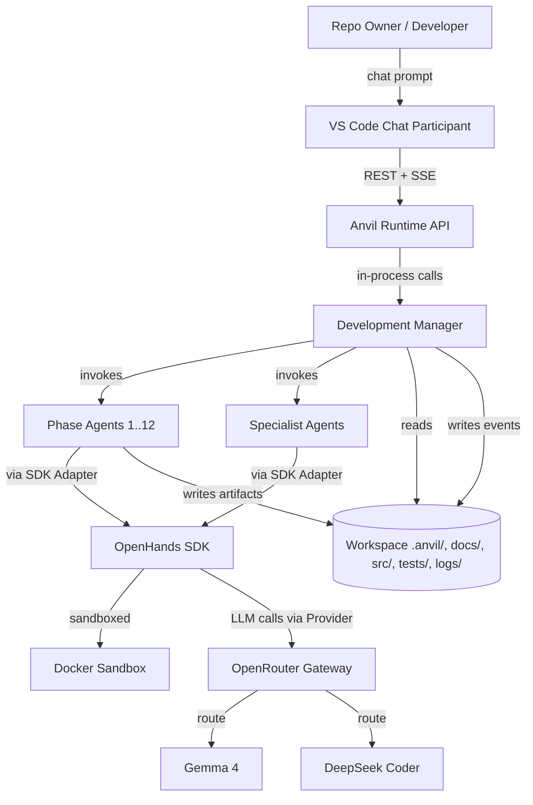
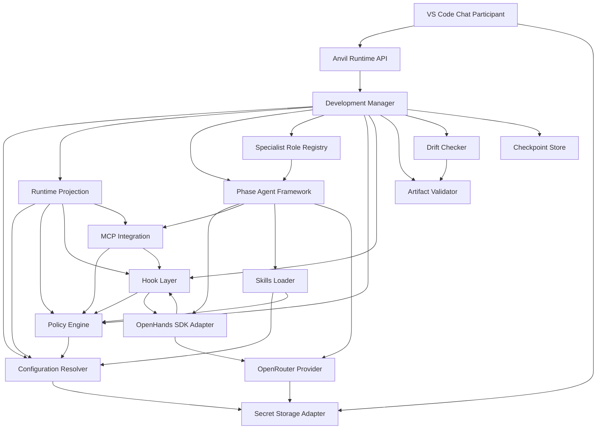
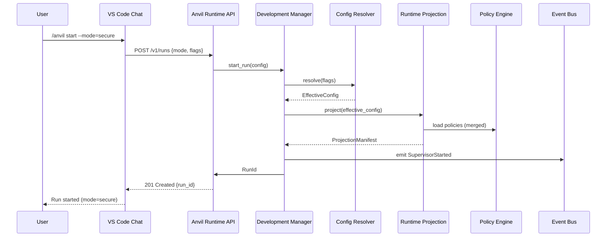
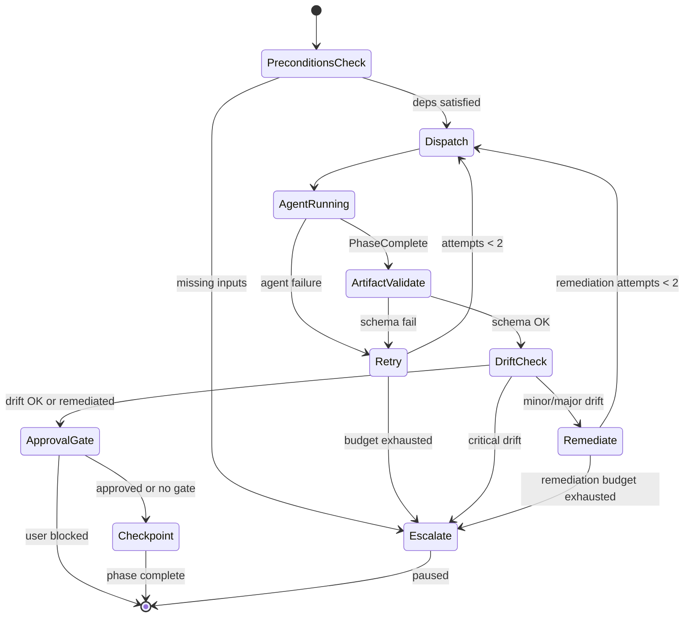
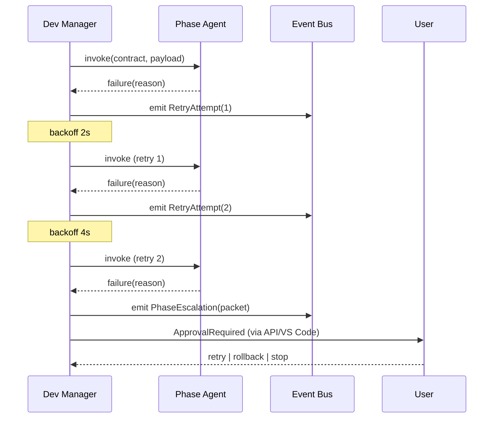
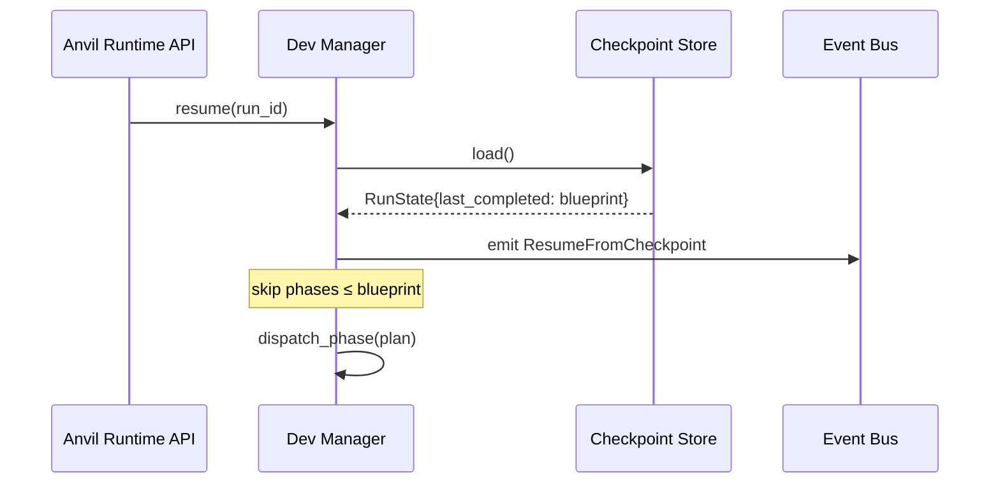

# Anvil Architecture (v0.1.0)

## 1. Overview

This document defines the component architecture for **Anvil v0.1.0**, a local-first, supervisor-orchestrated coding factory built on the OpenHands SDK and OpenRouter LLMs. It is derived from [docs/proposal.md](proposal.md) (intent and scope) and [docs/spec.md](spec.md) (testable requirements), and translates them into a concrete set of components, interactions, and runtime models that downstream phases (Blueprint, Plan, Implementation) can directly consume.

The architecture is shaped by three forces:

1. **Instruction fidelity and drift control** — explicit phase contracts, single-writer artifact ownership, and mandatory drift checks at phase boundaries.
2. **Token and latency efficiency** — progressive disclosure of skills, reference-based phase handoff, and serial execution with parallel-ready DAG semantics.
3. **Auditable governance** — policy-driven hooks at every lifecycle boundary, a structured event stream as the source of truth for escalation, and deterministic security profiles.

Section 3 enumerates the components; sections 4 and 5 show how they interact; sections 6–8 cover cross-cutting concerns (config/runtime, security, performance); section 9 maps every spec requirement to the component that owns it.

---

## 2. Architecture Principles

The following principles are normative — every component decision in §3 traces back to one or more of them.

1. **Supervisor-centric orchestration, single-writer artifacts.** Exactly one Development Manager coordinates phase progression; exactly one phase agent owns each artifact path. The supervisor never authors phase artifacts; phase agents never write outside their declared output paths. (Spec FR-ROLE-001 through FR-ROLE-005.)
2. **Contract-driven phase agents.** Each phase agent has explicit inputs, outputs, allowed tools, model constraints, and completion criteria. Contracts are the authoritative task boundary; prompt content cannot widen them. (Spec FR-PA-001 through FR-PA-010.)
3. **Artifact-first workflow.** Design intent (proposal → spec → architecture → blueprint → plan) precedes code. All artifacts carry lineage metadata (front-matter + SHA-256 checksums) so downstream consumers can verify they read the same version. (Spec §2.3, §4.1.)
4. **Policy and hook enforcement at lifecycle boundaries.** Policies declare intent; hooks enforce it deterministically at tool use, prompt submission, and session/phase transitions. Auto-remediation is attempted before escalation. (Proposal §8.4, §8.8; Spec §2.6, §5.1.)
5. **Layered configuration precedence with runtime projection.** A fixed four-level merge (run-time flag > workspace > user-root > built-in) produces effective configuration once per run; that snapshot is materialized into a workspace-local runtime projection so the run is reproducible and auditable. (Proposal §8.5, §8.10; Spec §2.7, §7.)
6. **Progressive disclosure for token efficiency.** Skills, prior artifacts, and context are loaded on demand by reference, not preloaded inline. Average phase context payload ≤ 4000 tokens. (Spec §2.9, NFR-TK-001/002.)
7. **Bounded self-healing with deterministic escalation.** Retries (default 2 per phase, exponential backoff), remediation attempts (separate budget of 2), and drift remediation are tried before escalation. Every escalation packet includes phase context and event references. (Spec §2.1.5, §2.5.3, §8.)
8. **Forward-compatible serial execution.** Phase dependencies are declared as a DAG, but v0.1.0 executes serially to preserve simple resume and self-heal semantics. The contract is parallel-ready; the scheduler is not. (Proposal §8.6.)
9. **Transport-agnostic agent contracts.** v0.1.0 uses in-process agent invocation and a localhost REST API; agent contracts are designed so a future message bus or A2A peer transport can be added without rewriting agent logic. (Proposal §6 non-goals; background §455–459.)
10. **Auditable by default, with named security profiles.** Every supervisor action is logged to a structured event stream. Three security profiles (`open`, `restricted`, `strict`) apply uniformly to MCP tools, network access, and policy strictness. (Spec §6.1, NFR-OB-001 through NFR-OB-005.)

---

## 3. Component Definitions

Components are grouped into seven logical layers. Each component lists its responsibility, the spec requirements it owns, its dependencies, and the interfaces it exposes.

### 3.1 Surfaces (User-Facing Layer)

#### 3.1.1 VS Code Chat Participant

**Responsibility.** The user's primary interaction surface. Implemented via `vscode.chat.createChatParticipant`, it accepts natural-language prompts, surfaces phase progress, approval requests, and escalations through native VS Code affordances (status bar, notifications, chat replies). It is a thin client — it holds no Anvil state and performs no LLM calls of its own.

**Owns.** Proposal §3 (chat participant + native affordances), §7 (mode display), §12 (Secret Storage access).

**Depends on.** Anvil Runtime API (§3.1.2), Secret Storage Adapter (§3.3.3).

**Interfaces.** Outbound HTTP/SSE calls to `http://localhost:<port>/v1/...`. Inbound VS Code chat events. Reads/writes OpenRouter API key via `vscode.SecretStorage`.

#### 3.1.2 Anvil Runtime API

**Responsibility.** A localhost FastAPI service that exposes versioned endpoints for run control, phase state, artifacts, events, and health. It is the integration boundary between the VS Code extension (and any future programmatic caller) and the in-process Development Manager. Streams events back to clients via Server-Sent Events.

**Owns.** Proposal §3 (localhost REST API), proposal §6 in-scope item (programmatic users), spec §2.1.7 (event stream exposure).

**Depends on.** Development Manager (§3.2.1), Event Bus (§3.5.1), Checkpoint Store (§3.5.2).

**Interfaces.**
- `POST /v1/runs` — start a run (mode, profile, overrides).
- `GET /v1/runs/{id}` — run state and current phase.
- `POST /v1/runs/{id}/approve` — supply approval at a gated checkpoint.
- `POST /v1/runs/{id}/override` — phase rollback / force-advance.
- `GET /v1/runs/{id}/events` — SSE stream of audit events.
- `GET /v1/artifacts/{phase}` — artifact metadata + content.
- `GET /v1/health` — readiness/liveness with diagnostic summary.

### 3.2 Orchestration Core

#### 3.2.1 Development Manager (Supervisor)

**Responsibility.** The central orchestrator. Loads effective configuration, validates runtime prerequisites, maintains the phase DAG, dispatches phase agents in topological order, enforces operational mode gates (YOLO/Gated/Secure), runs validation and drift checks at phase boundaries, manages retry and escalation budgets, and persists checkpoints. It is a coordinator only — it never authors phase artifacts (FR-ROLE-001).

**Owns.** Spec FR-SV-001 through FR-SV-026; FR-OM-001 through FR-OM-014; §2.1.5 retry/escalation; §2.1.6 checkpoint resume; §2.1.7 audit trail emission.

**Depends on.** Configuration Resolver (§3.3.1), Runtime Projection Layer (§3.3.2), Phase Agent Framework (§3.2.2), Specialist Role Registry (§3.2.3), Policy Engine (§3.4.1), Hook Layer (§3.4.2), Artifact Validator (§3.4.3), Drift Checker (§3.4.4), Event Bus (§3.5.1), Checkpoint Store (§3.5.2).

**Interfaces.**
- `start_run(config) → RunId` — begin a new run.
- `dispatch_phase(phase_id) → PhaseResult` — invoke a phase agent.
- `await_approval(gate_id) → ApprovalSignal` — block on a gated phase.
- `escalate(packet) → UserDecision` — pause and surface an escalation.
- `resume(run_id) → RunState` — restart from last checkpoint.

#### 3.2.2 Phase Agent Framework

**Responsibility.** A common runtime that hosts the twelve phase agents (proposal, factory_init, specification, architecture, blueprint, dev_plan, implementation, qa, packaging, documentation, deployment, cleanup). Each agent is a configured instance with a declarative contract (inputs, outputs, allowed tools, model constraints, completion criteria). The framework enforces single-writer rules, surfaces task-level events, and emits structured `PhaseComplete` payloads with artifact checksums.

**Owns.** Spec FR-PA-001 through FR-PA-010; proposal §9 (twelve-phase pipeline); per-artifact schemas in spec §4.1.

**Depends on.** OpenHands SDK Adapter (§3.7.2), MCP Integration Layer (§3.6.1), Skills Loader (§3.6.2), OpenRouter LLM Provider (§3.7.1), Event Bus (§3.5.1), Policy Engine (§3.4.1).

**Interfaces.**
- `invoke(contract, payload) → PhaseResult`
- `emit_event(event)` — task-level observability (`FileWritten`, `ReviewCompleted`, etc.).
- Contract schema: `{phase_id, inputs[], outputs[], allowed_tools[], model_constraints, completion_criteria[]}`.

#### 3.2.3 Specialist Role Registry

**Responsibility.** Loads and validates the optional specialist role registry (`.anvil/specialist-roles.yaml`) at run start. Provides the Development Manager with role definitions for bounded non-phase contributors (security review, performance analysis, etc.). Enforces that specialist invocations cannot transfer ownership of canonical phase outputs and must pass the same policy gates as phase agents.

**Owns.** Spec FR-SA-001 through FR-SA-017; spec §4.1.10 (registry artifact).

**Depends on.** Configuration Resolver (§3.3.1), Policy Engine (§3.4.1), Event Bus (§3.5.1).

**Interfaces.**
- `load_registry() → SpecialistRole[]`
- `validate(role_def) → ValidationResult`
- `invoke(role_id, context) → SpecialistResult`

### 3.3 Configuration and Runtime

#### 3.3.1 Configuration Resolver

**Responsibility.** Resolves the effective runtime configuration once per run by merging four precedence levels: run-time flags > workspace-local (`.anvil/config.yaml`) > user-root (`~/.anvil/config.yaml`) > extension built-ins. Applies the documented merge semantics: scalars override, lists union, maps deep-merge. Validates the merged schema against the current `configVersion` and logs the effective configuration to the audit trail.

**Owns.** Spec FR-CF-001 through FR-CF-007; §7 (configuration management); proposal §8.10.

**Depends on.** Secret Storage Adapter (§3.3.3) for resolving secret references.

**Interfaces.**
- `resolve(invocation_flags) → EffectiveConfig`
- `validate(config) → ValidationResult`
- `snapshot(config) → JSON` — for the audit trail.

#### 3.3.2 Runtime Projection Layer

**Responsibility.** At run start, materializes user-root intent (`~/.anvil/`) and workspace overrides into a workspace-local runtime projection. Writes:
- `.openhands/hooks.json` — OpenHands-compatible compiled hook config.
- `.openhands/runtime/mcp.generated.json` — resolved MCP server config.
- `.openhands/runtime/policy-snapshot.json` — effective merged policy.
- `.agents/skills/` — workspace skill overlays.
- `.anvil/run-state.json` — checkpoint store (initialized; written to by §3.5.2).

This makes runs reproducible: the entire effective configuration is committed to a known set of files before any agent work begins.

**Owns.** Proposal §8.5 (runtime projection model); background-information lines 530–541 (directory mapping).

**Depends on.** Configuration Resolver (§3.3.1), Policy Engine (§3.4.1), Hook Layer (§3.4.2), MCP Integration Layer (§3.6.1).

**Interfaces.**
- `project(effective_config) → ProjectionManifest`
- `verify_projection() → ValidationResult`

#### 3.3.3 Secret Storage Adapter

**Responsibility.** Single point of access for the OpenRouter API key and any other secrets (e.g., MCP server credentials). Uses VS Code Secret Storage by default; falls back to the `OPENROUTER_API_KEY` environment variable for CI/headless scenarios. Exposes a redaction interface used by the Event Bus to scrub secrets from logs.

**Owns.** Spec NFR-SC-001 through NFR-SC-005; spec §3.5, §6.3, §6.4.

**Depends on.** None (leaf component).

**Interfaces.**
- `get_secret(name) → string`
- `redact(text) → string` — applies `SecretRedactionRules` policy.

### 3.4 Policy and Enforcement

#### 3.4.1 Policy Engine

**Responsibility.** Loads policy files from `~/.anvil/policies/` and `.anvil/policies/`, merges them through the same precedence model as configuration, and evaluates policy checks at runtime. Built-in policies include `AllowedModels`, `TokenBudgetPerPhase`, `MaxRetriesPerPhase`, `MCPToolWhitelist`/`Blacklist`, `SecretRedactionRules`, `NetworkAccessPolicy`, and `RequiredApprovalGates`. Policy decisions are remediable or non-remediable per policy definition; the engine routes remediable violations through the remediation strategies in spec §2.6.4 before allowing escalation.

**Owns.** Spec FR-PL-001 through FR-PL-008; §4.3 policy file schema; §2.6.2 core policies.

**Depends on.** Configuration Resolver (§3.3.1), Event Bus (§3.5.1).

**Interfaces.**
- `check(action_context) → AllowDecision | DenyDecision | RemediationRequest`
- `enforce(decision) → EnforcementResult`
- `list_policies() → Policy[]`

#### 3.4.2 Hook Layer

**Responsibility.** Executes lifecycle-boundary interceptors compiled into `.openhands/hooks.json`. Supports the OpenHands-native typed events (`PreToolUse`, `PostToolUse`, `UserPromptSubmit`, `SessionStart`, `SessionEnd`, `Stop`) with the standard blocking contract (exit code 2 = block). Hooks call into the Policy Engine for allow/deny decisions and emit hook-execution events for audit. Anvil's source-of-truth hook definitions live under `~/.anvil/hooks/` and are merged with workspace overrides during runtime projection.

**Owns.** Proposal §8.8; background §544–562; spec §5.1.

**Depends on.** Policy Engine (§3.4.1), Event Bus (§3.5.1), OpenHands SDK Adapter (§3.7.2).

**Interfaces.**
- `pre_tool_use(tool, args) → Allow | Deny | Mutate`
- `post_tool_use(tool, result, duration) → void`
- `user_prompt_submit(prompt, model) → Allow | Deny | Mutate`
- `stop(phase, artifacts) → Allow | Block`

#### 3.4.3 Artifact Validator

**Responsibility.** After a phase agent reports completion, validates produced artifacts against their declared schema (spec §4.1). Checks include: required sections present, minimum content thresholds (e.g., spec ≥ 10 FRs; architecture ≥ 8 components), front-matter well-formed, Markdown syntactically valid. Validation is deterministic pass/fail (no warnings). Times out at 30 seconds per artifact (NFR-LT-004).

**Owns.** Spec FR-AR-001 through FR-AR-006; per-artifact validation criteria in §4.1.

**Depends on.** Event Bus (§3.5.1).

**Interfaces.**
- `validate(phase, artifact_paths) → ValidationResult`
- `schema(phase) → ArtifactSchema`

#### 3.4.4 Drift Checker

**Responsibility.** After implementation and at every artifact boundary, compares downstream artifacts against upstream controlling artifacts in the required order: **Blueprint → Architecture → Spec** (FR-DR-002A). Detects five drift categories (spec §2.5.1): code features absent from blueprint/architecture/spec; missing/incomplete components; unverified non-functional requirements; naming and boundary violations; test coverage gaps. Categorizes drift as minor/major/critical and routes through the appropriate remediation path: minor → phase agent re-invocation, major → upstream phase rollback, critical → escalation.

**Owns.** Spec FR-DR-001 through FR-DR-010.

**Depends on.** Artifact Validator (§3.4.3), Event Bus (§3.5.1).

**Interfaces.**
- `check(phase, code_or_artifact) → DriftReport`
- `remediate(drift_report) → RemediationResult`

### 3.5 Observability and State

#### 3.5.1 Event Bus / Audit Trail

**Responsibility.** Single structured event stream for all supervisor actions, hook executions, phase lifecycle transitions, and token/cost telemetry. Emits to `.anvil/events.jsonl` (one JSON event per line; monotonically increasing timestamps). Applies secret redaction (via §3.3.3) before write. Indexed by event type, timestamp, phase, severity, and run ID for queryability. Also surfaces over Server-Sent Events through the Anvil Runtime API.

**Owns.** Spec §4.2.1 event schema; NFR-OB-001 through NFR-OB-005; spec §5 hooks-and-events lifecycle.

**Depends on.** Secret Storage Adapter (§3.3.3) for redaction.

**Interfaces.**
- `emit(event)` — append to stream.
- `query(filter) → Event[]` — by phase, type, severity, timeframe.
- `subscribe(filter) → Stream<Event>` — for SSE.

#### 3.5.2 Checkpoint and Resume Store

**Responsibility.** Persists run state after every phase completion to `.anvil/run-state.json`: phase name, completion timestamp, artifact checksums, mode, profile, retry counters. On restart, identifies the last completed phase and signals the Development Manager to resume from the next incomplete phase. Versioned (`runStateVersion`) for forward compatibility.

**Owns.** Spec FR-SV-021 through FR-SV-023; NFR-RB-004, NFR-RB-005.

**Depends on.** Event Bus (§3.5.1) for emitting `ResumeFromCheckpoint`.

**Interfaces.**
- `save(phase, metadata) → void`
- `load() → RunState | null`
- `last_completed_phase() → PhaseId | null`

### 3.6 Tools and Knowledge

#### 3.6.1 MCP Integration Layer

**Responsibility.** Discovers, authorizes, and invokes MCP (Model Context Protocol) servers declared in the runtime projection. Performs bounded discovery (5 second per-server timeout, NFR-LT-003), caches tool schemas in `.anvil/mcp-tools-cache.json`, validates agent tool arguments against discovered schemas, and enforces tool authorization per the active security profile (open/restricted/strict). Includes the built-in core toolset (file I/O, git ops, logging, sandboxed shell) that is always available regardless of profile.

**Owns.** Spec FR-MC-001 through FR-MC-014; §6.1 security profile applicability for tools.

**Depends on.** Policy Engine (§3.4.1), Hook Layer (§3.4.2), Event Bus (§3.5.1), Runtime Projection Layer (§3.3.2).

**Interfaces.**
- `discover() → ToolCatalog`
- `authorize(tool_name, profile) → AuthDecision`
- `invoke(tool_name, args) → ToolResult`

#### 3.6.2 Skills Loader

**Responsibility.** Implements progressive-disclosure skill loading. Skills (Markdown bundles with `SKILL.md` or `skill.json` manifests) are stored in `~/.anvil/skills/` and `.agents/skills/` and are loaded on demand when (a) a phase contract references them by name, (b) an agent explicitly requests one, or (c) drift remediation suggests one. Workspace skills override user-root skills by name; the resolved skill list is finalized at phase start.

**Owns.** Spec FR-SK-001 through FR-SK-008; proposal §8.7; background §581–600.

**Depends on.** Configuration Resolver (§3.3.1), Policy Engine (§3.4.1), Runtime Projection Layer (§3.3.2).

**Interfaces.**
- `resolve_for_phase(phase_id) → Skill[]`
- `load(skill_name) → SkillBundle`
- `emit_skill_loaded(skill) → void` — token-budget event.

### 3.7 External Integrations

#### 3.7.1 OpenRouter LLM Provider

**Responsibility.** Single abstraction over OpenRouter's model gateway. Implements **phase + task hybrid routing**: each phase declares a default model; subtasks within a phase (planning, coding, debugging, review) may route to different models. Initial defaults: Gemma 4 for planning/analysis/architecture; DeepSeek Coder for coding-heavy work. Supports user overrides at both phase and subtask granularity through configuration precedence. Tracks per-phase token usage and surfaces it to the Policy Engine for `TokenBudgetPerPhase` enforcement.

**Owns.** Proposal §10; spec §2.6 (model allowlist policy); NFR-TK-001 through NFR-TK-003.

**Depends on.** Secret Storage Adapter (§3.3.3), Policy Engine (§3.4.1), Event Bus (§3.5.1).

**Interfaces.**
- `complete(phase, subtask, prompt) → CompletionResult`
- `route(phase, subtask) → ModelId`
- `usage_report(phase) → TokenUsage`

#### 3.7.2 OpenHands SDK Adapter

**Responsibility.** Wraps the OpenHands runtime (Tier-1 "agent core" in background §332). Manages the Dockerized execution sandbox, the OpenHands event stream, action/observation routing, and `LLM_CONFIG` wiring to the OpenRouter Provider. Surfaces native OpenHands events into the Anvil Event Bus and consumes hook configuration from `.openhands/hooks.json` produced by the Runtime Projection Layer. v0.1.0 uses in-process agent invocation; transport-agnostic interface allows a future message-bus or A2A migration without contract change.

**Owns.** Proposal §3 (OpenHands as orchestration engine); background §327–367 (custom agent architecture).

**Depends on.** OpenRouter LLM Provider (§3.7.1), Hook Layer (§3.4.2), Event Bus (§3.5.1).

**Interfaces.**
- `start_session(agent_config) → SessionId`
- `dispatch_action(session, action) → Observation`
- `event_stream(session) → Stream<OpenHandsEvent>`

---

## 4. Data Flow Diagrams

### 4.1 System Context



### 4.2 Component Dependency Graph

Acyclic by construction; the Event Bus is a write-only sink for most components and is therefore not shown as introducing dependencies.



---

## 5. System Interactions and Sequencing

### 5.1 Run Start



### 5.2 Phase Execution Lifecycle

State machine for a single phase, executed inside `dispatch_phase`:



### 5.3 Failure, Retry, and Escalation



### 5.4 Resume from Checkpoint



---

## 6. Configuration and Runtime Model

### 6.1 Configuration Precedence

```
Level 1 — Run-time flags          (highest priority)
Level 2 — Workspace config         .anvil/config.yaml
Level 3 — User-root config         ~/.anvil/config.yaml
Level 4 — Extension built-ins      (lowest priority)
```

Merge semantics:
- **Scalars**: higher level overrides lower.
- **Lists**: appended (union behavior) — e.g., `AllowedModels` accumulates entries from every level.
- **Maps**: deep-merged — keys at higher levels override; lower-level keys are retained when not overridden.

The merged result is validated against `configVersion: "0.1.0"` and logged at run start (FR-CF-005).

### 6.2 Runtime Projection

User intent lives in `~/.anvil/`; the run's actual runtime config is materialized into the workspace at run start:

```
~/.anvil/                     (source of truth)
├── agents/
├── skills/
├── mcp/servers.json
├── hooks/hooks.json
├── policies/*.yaml
└── runtime/defaults.yaml

<workspace>/                  (generated per run)
├── .agents/skills/                              # workspace skill overlays
├── .anvil/
│   ├── config.yaml          (workspace overrides)
│   ├── policies/            (workspace policy overrides)
│   ├── specialist-roles.yaml
│   ├── run-state.json       (checkpoint)
│   ├── events.jsonl         (audit trail)
│   └── mcp-tools-cache.json
└── .openhands/
    ├── hooks.json           (compiled effective hooks)
    └── runtime/
        ├── mcp.generated.json
        └── policy-snapshot.json
```

The projection is the durable record of "what configuration this run actually used."

### 6.3 Operational Modes

- **YOLO** — auto-advance through all phases; user-facing approval gates skipped; supervisor controls (validation, drift, policy, retries, checkpoints) remain enforced.
- **Gated** — user pre-selects a list of phases requiring approval; supervisor pauses at those.
- **Secure** — four mandatory gates enforced (Post-Proposal, Post-Architecture, Post-Blueprint, Pre-Deployment-Plan); user may add more but cannot remove the four. Explicit approval signal required at each.

Mode is set at run start and immutable for the duration of the run.

---

## 7. Security Architecture

### 7.1 Security Profiles

| Profile | MCP tool access | Network access | Policy strictness | Default for |
|---|---|---|---|---|
| `open` | All discovered tools allowed unless explicitly blacklisted | Configured endpoints | Advisory; violations logged | Single-user local dev |
| `restricted` | Whitelist required (`MCPToolWhitelist`) | Policy-approved hosts only | Violations escalate | Team workspaces, CI |
| `strict` | Built-in core tools only unless explicitly enabled per-tool | Approved destinations only | No auto-remediation; immediate escalation | Regulated environments |

Profile is selected at run start and applies uniformly to all phases (FR-SC-001/002).

### 7.2 Secret Management

- OpenRouter API key stored in VS Code Secret Storage (`vscode.SecretStorage`) by default.
- `OPENROUTER_API_KEY` environment variable fallback for headless/CI.
- All secrets accessed exclusively through the Secret Storage Adapter (§3.3.3).
- The Event Bus invokes the adapter's `redact()` before writing any event; `SecretRedactionRules` policy supplies the regex patterns.
- MCP server connection strings and webhook URLs marked `sensitive: true` in config are redacted from the audit trail.

### 7.3 Network Policy

- Enforced via `NetworkAccessPolicy` and the `PreToolUse` hook.
- Default allowlist for `restricted` profile: OpenRouter endpoint, configured MCP server hosts, the project's git remote.
- Outbound requests to non-allowlisted hosts are blocked by the hook (exit code 2) and logged as `PolicyViolation` events.

### 7.4 MCP Tool Authorization

- Authorization is checked at invocation time, not discovery time.
- Discovery is bounded at 5 seconds per server; transient discovery failures fall back to the on-disk cache, and absence of cache escalates with actionable diagnostics.
- Tool argument schemas are validated before invocation; mismatch fails the operation and emits `MCPToolInvocationFailed`.

---

## 8. Scalability and Performance Considerations

### 8.1 Token Efficiency

- Phase-to-phase handoff uses file paths and git checksums by default; inline content only when < 500 tokens (NFR-TK-002).
- Average phase context payload budget: ≤ 4000 tokens (NFR-TK-001).
- Token usage tracked per phase by the OpenRouter Provider; `TokenBudgetPerPhase` policy enforces hard caps.
- Skills loaded only when triggered; never preloaded wholesale.

### 8.2 Latency Targets

| Operation | Target | Source |
|---|---|---|
| Phase handoff (dispatch + validation) | ≤ 500 ms | NFR-LT-001 |
| Drift check (per phase) | ≤ 60 s | NFR-LT-002 |
| MCP tool discovery (per server) | ≤ 5 s | NFR-LT-003 |
| Artifact validation (per artifact) | ≤ 30 s | NFR-LT-004 |
| Policy evaluation (per check) | ≤ 100 ms | NFR-LT-005 |
| Mean time to recovery (transient failure) | < 10 s | NFR-RB-006 |

### 8.3 Serial Execution Today, Parallel-Ready Tomorrow

v0.1.0 executes the phase DAG serially in topological order. The DAG declaration is the durable contract; the scheduler is the swappable part. A future release can introduce a parallel scheduler that respects the same dependency declarations without changing phase agent contracts. Independent specialist invocations are similarly forward-compatible: their role contracts declare allowed invocation phases but do not assume serial execution.

### 8.4 Bounded Self-Healing

Three independent retry budgets, each defaulting to 2 attempts (overridable through configuration precedence):

- **Phase retry budget** (FR-SV-018) — covers agent execution failures.
- **Remediation budget** (FR-DR-008) — covers drift remediation.
- **MCP tool retry budget** (FR-MC-013) — covers transient tool invocation failures.

Exponential backoff (2 s base, 4 s second attempt). All budgets exhausted → escalation packet emitted to user with full phase context, last 50 events, retry history, and suggested recovery actions.

---

## 9. Gap Analysis (Spec vs. Architecture)

Every spec section maps to one or more components. Empty rows would indicate drift; this table has none.

| Spec Section | Requirements | Owning Component(s) |
|---|---|---|
| §2.1.1 Supervisor Initialization | FR-SV-001 – FR-SV-004 | Development Manager, Configuration Resolver, Runtime Projection |
| §2.1.2 Phase Management & Dispatch | FR-SV-005 – FR-SV-010 | Development Manager, Phase Agent Framework, Artifact Validator |
| §2.1.3 Role Separation (single-writer) | FR-ROLE-001 – FR-ROLE-005 | Development Manager, Phase Agent Framework |
| §2.1.3 Operational Mode Enforcement | FR-SV-011 – FR-SV-013 | Development Manager, Anvil Runtime API |
| §2.1.4 Artifact Validation & Drift | FR-SV-014 – FR-SV-016 | Artifact Validator, Drift Checker |
| §2.1.5 Error Recovery & Escalation | FR-SV-017 – FR-SV-020 | Development Manager, Event Bus |
| §2.1.6 Checkpoint-Based Resume | FR-SV-021 – FR-SV-023 | Checkpoint Store, Development Manager |
| §2.1.7 Logging & Audit Trail | FR-SV-024 – FR-SV-026 | Event Bus |
| §2.2 Phase Agent Contracts | FR-PA-001 – FR-PA-010 | Phase Agent Framework |
| §2.3 Artifact Production & Validation | FR-AR-001 – FR-AR-006 | Artifact Validator, Phase Agent Framework |
| §2.4 Operational Modes | FR-OM-001 – FR-OM-014 | Development Manager, Anvil Runtime API |
| §2.5 Drift Detection & Remediation | FR-DR-001 – FR-DR-010 | Drift Checker, Development Manager |
| §2.6 Policy Enforcement | FR-PL-001 – FR-PL-008 | Policy Engine, Hook Layer |
| §2.7 Configuration Precedence | FR-CF-001 – FR-CF-007 | Configuration Resolver, Runtime Projection |
| §2.8 MCP Tool Integration | FR-MC-001 – FR-MC-014 | MCP Integration Layer, Policy Engine, Runtime Projection |
| §2.9 Skills Loading | FR-SK-001 – FR-SK-008 | Skills Loader |
| §2.10 Specialist Agent Extensibility | FR-SA-001 – FR-SA-017 | Specialist Role Registry, Phase Agent Framework |
| §3.1 Token Efficiency | NFR-TK-001 – NFR-TK-003 | OpenRouter Provider, Skills Loader, Phase Agent Framework |
| §3.2 Latency & Performance | NFR-LT-001 – NFR-LT-005 | Development Manager, MCP Integration, Artifact Validator, Policy Engine |
| §3.3 Observability | NFR-OB-001 – NFR-OB-005 | Event Bus, Secret Storage Adapter |
| §3.4 Reliability & Recovery | NFR-RB-001 – NFR-RB-006 | Development Manager, Drift Checker, Checkpoint Store |
| §3.5 Security & Secrets | NFR-SC-001 – NFR-SC-005 | Secret Storage Adapter, Event Bus, OpenRouter Provider |
| §3.6 Backward Compatibility | NFR-BC-001 – NFR-BC-004 | Configuration Resolver, Checkpoint Store, Artifact Validator, Specialist Role Registry |
| §4.1 Phase Artifact Schemas | §4.1.1 – §4.1.10 | Artifact Validator (schemas), Phase Agent Framework (production) |
| §4.2 Event & Hook Schemas | §4.2.1, §4.2.2 | Event Bus, Hook Layer |
| §4.3 Policy File Schema | — | Policy Engine |
| §5 Hooks & Events Lifecycle | §5.1 – §5.3 | Hook Layer, Event Bus |
| §6 Security & Access Control | FR-SC-001 – FR-SC-003 | Policy Engine, Secret Storage Adapter, MCP Integration |
| §7 Configuration Management | — (summary of §2.7) | Configuration Resolver |
| §8 Error Handling & Recovery | §8.1 – §8.4 | Development Manager, Event Bus |

**No gaps identified.** Every functional and non-functional requirement traces to at least one component.

---

**Status**: Draft v1, ready for collaborative review.

**Next phase**: Upon approval, proceed to [docs/blueprint.md](blueprint.md) derivation.
