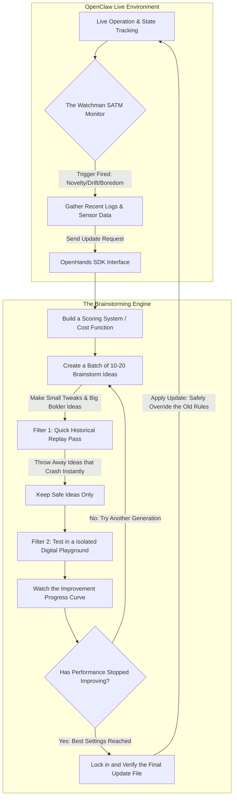

# Anvil Feature Proposal: The Smart Reinforcement Learning Update Loop (v1.0.0)

## 1. Summary
This proposal introduces a new feature for **Anvil** (our automated coding team): a smart, self-correcting update system for software or robots running on **OpenClaw**. 

When OpenClaw runs into a situation it doesn't understand, it calls the **OpenHands SDK**. OpenHands acts like an AI engineering brainstorming room. It studies what went wrong, plays around with new rules using an evolutionary approach (trial and error), tests them safely inside a hidden digital playground (a Docker container), and delivers a finely tuned update file ($\Delta RL$) to get the system back on track.

## 2. The Problems We Are Solving
When AI agents or robots operate in the real world, they usually run into three major roadblocks:
1. **The World Changes Unexpectly:** A robot navigating smoothly on grass suddenly hits soft sand. The old way of moving no longer works, and the system begins to slip or fail.
2. **You Can't Just Use Math to Tweak Prompts:** The system's rules are a messy mix of English instructions (prompts), code logic, and numbers. You can't use standard calculus or gradient math to calculate how to fix a paragraph of text.
3. **Over-Filtering and "Fear" (Fragility):** If an automated fixer tries to eliminate *every single tiny error*, the robot becomes too afraid to move. It over-corrects, gets stuck, and freezes up the second it encounters normal real-world friction.

## 3. How the Core Workflow Works
This system runs a smart loop that isolates the live, busy robot or software from the heavy thinking required to rewrite code. This keeps costs down and keeps the live environment safe.

## 4. The Core Components

### 4.1 The "Watchman" Sentinel (SATM)
The Self-Awareness and Telemetry Monitor (SATM) is a lightweight background thread that sits on the robot or active software. It is always awake, watching the logs and asking two smart questions:
- **"Am I completely bored?" (Information Gain):** It measures how much the system is learning. If the robot is burning computing power, time, or tokens, but its success rate is completely flatlining, the Watchman triggers an update because the system is spinning its wheels without making progress.
- **"Am I stuck in a loop?" (Stagnation):** If the system keeps bouncing back and forth between two identical states without actually finishing the job, the Watchman notices the deadlock and forces an evolutionary update.

### 4.2 The Evolutionary Brainstormer (Trial-and-Error)
Because we can't use standard math to tweak written instructions or state logic, the OpenHands engine acts like nature—it uses evolution:
- **The Chromosome (The DNA):** The engine bundles up the software's prompt rules, numbers, and logic into a single packet it can modify.
- **Smart Scaling ($\sigma$-operators):** It creates variations of this DNA based on the situation. For minor drift, it makes small, careful adjustments ($\pm1\sigma$). If the system hits a brand-new surface like sand, it makes big, bold structural leaps to the logic ($\pm2\sigma$). It blocks wild, chaotic changes ($\pm3\sigma$) that would break the software entirely.

### 4.3 Designing for "Non-Lethal Pain"
A core rule of our scoring system is that **minor pain is good for long-term survival**. The system explicitly tolerates minor, harmless friction—like a wheel slipping slightly on sand, brief API lag, or a small spike in token usage—if it means getting valuable data that helps achieve the main goal. Trying to completely avoid all minor discomfort makes software fragile; allowing "non-lethal pain" makes it robust.

### 4.4 The Two-Stage Sieve (Saving Time and Money)
To make sure we don't blow through API token budgets testing bad ideas, we run a two-step screening process:
1. **The Static Replay:** We take the brainstormed ideas and play them against a recorded video/log of the exact moment the system failed. If an idea breaks basic coding rules or crashes immediately, we delete it right away without spending money on it.
2. **The Live Sandbox Playground:** Only the ideas that pass the replay test get to run inside isolated, temporary Docker containers. Here, we stream simulated real-world data to see how they adapt dynamically.
