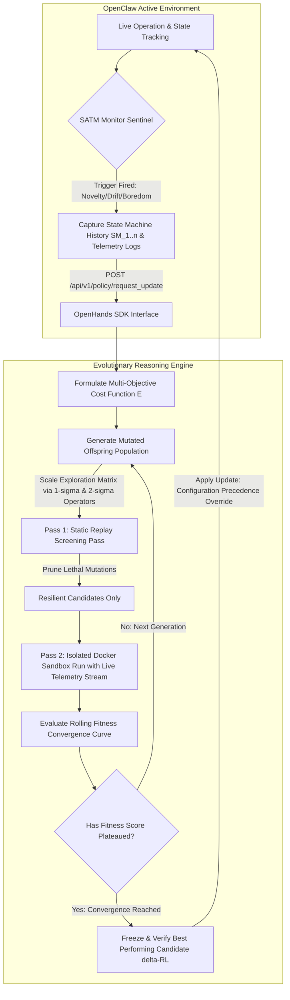

# Anvil Feature Proposal: Autonomous Reinforcement Learning Policy Amendment Loop (v1.0.0)

## 1. Executive Summary
This proposal specifies an extension to the **Anvil** multi-agent development factory: an autonomous, supervisor-orchestrated Reinforcement Learning (RL) Policy Amendment Engine. Operating as a specialized capability within the Anvil ecosystem, this module enables swarm, orchestrator, or edge robotic runtimes (e.g., **OpenClaw**) to request dynamic policy updates from the **OpenHands SDK**. The core objective is to deliver a sample-efficient, risk-sensitive, evolutionary optimization pipeline that transforms operational failures and "existential boredom" into verified, resilient policy updates ($\Delta RL$) via an isolated Docker simulation sandbox.

## 2. Problem Statement & Context
Complex agentic workflows and automated cyber-physical systems operating in non-sterile, dynamic environments frequently encounter three critical operational boundary failures:
1. **Unmodeled Environmental Transitions:** Structural shifts in external dynamics (e.g., a robot transitioning from smooth grass to high-friction sand) render the active baseline policy unstable.
2. **Gradient Discontinuity:** The active policy runtime comprises heterogeneous parameters—discrete prompt instructions, brittle state-machine schemas, and continuous numerical boundaries. Standard gradient-descent optimization cannot compute derivatives across these mixed-type systems.
3. **Exploration Over-Filtering ("Pain-Avoidance Fragility"):** Standard automated correction loops often penalize all transient telemetry errors equally. This produces fragile, overly cautious behavior that overfits to sterile environments and deadlocks or crashes when confronted with normal real-world friction.

## 3. System Scope & Core Flow
The proposed engine functions as a closed-loop reactive optimization framework. It decouples the live operational runtime from the heavy evolutionary reasoning loop, keeping execution token-efficient and safeguarding live hardware or mission-critical systems.

## 4. Architectural Integrations & Components

### 4.1 Self-Awareness & Telemetry Monitor (SATM)
The SATM acts as an asynchronous background supervisor wrapped directly around the active state machine runtime. It tracks historical execution profiles and evaluates system health against two key metrics:
- **Information Gain ($\Delta I$):** Calculated as the absolute delta of performance tracking error between steps ($\Delta I = |E_n - E_{n-1}|$). When $\Delta I$ drops below a specified threshold ($\epsilon$) across a sustained execution window while resource consumption (tokens, power, cycles) climbs, the SATM identifies **"Existential Boredom"** and triggers a policy amendment request.
- **Goal Entropy & Stagnation:** Evaluates structural deadlock when a system remains trapped in a specific operational sub-phase $j_x$ for $n$ cycles without progressing to phase $j_{x+1}$.

### 4.2 Evolutionary Optimization Engine
Because gradients cannot be computed, the runtime leverages an **Evolution Strategies (ES)** model managed by the OpenHands framework using DeepSeek Coder and Claude models via OpenRouter:
- **The Chromosome String:** Encodes combined discrete and continuous variables including state-transition threshold logic, prompt execution strings, and multi-objective numerical resource weights.
- **$\sigma$-Scaled Mutation Operators:** Mutation vectors are strictly scaled based on environmental context. Tight $\pm1\sigma$ optimization handles incremental tracking drift. Bolder $\pm2\sigma$ mutations alter core state graphs and transitions when negotiating completely unmodeled environments ($SM_x$). Catastrophic $\pm3\sigma$ changes are structurally suppressed to minimize unviable exploration.

### 4.3 Risk-Sensitive Cost Function ("Non-Lethal Pain")
The system defines a global cost function:
$$E = f(SM_n, \sum_{i=1}^{n} SM_i, \mathcal{O}_{main})$$
The calculation structurally permits soft penalties (transient motor slippage, network latency, minor token spikes) if they contribute empirical variance data that optimizes the system's long-term survival and macro-objective tracking. The complete elimination of short-term friction is actively penalized, preventing the policy from freezing up in complex scenarios.

### 4.4 Tiered Sandbox Sieve
To protect the local context from token or compute depletion, evaluation runs are structured as a two-tiered sieve:
1. **Static Replay Pass:** Simulates the candidate policy against the exact array of immutable sensory logs captured during the live failure event. Code syntax anomalies and unviable logical forks are caught and culled immediately.
2. **Dynamic Live Sandbox:** Surviving candidates are mounted inside temporary, isolated Docker containers. The container streams mock real-time telemetry back into the state engine to observe dynamic compliance and calculate the terminal fitness plateau before pushing updates live via configuration precedence principles.