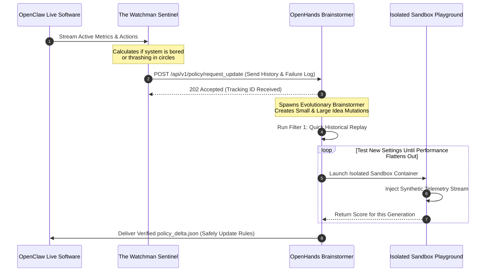

# Anvil Software Specification: The Smart RL Update Loop (v1.0.0)

## 1. Introduction & Communication Contracts
This document translates our high-level proposal into clear, rigid engineering instructions, exact communication patterns, and strict data rules.

### 1.1 The Data Blueprint: How States Look (JSON Schema)
Every time the system records a state machine or environmental status ($SM_n$), it must be saved in this exact structure so the AI brainstorming engine can read it perfectly:

```json
{
  "$schema": "https://json-schema.org/draft/2020-12/schema",
  "title": "StateMachineStateRegistry",
  "type": "object",
  "required": ["state_id", "timestamp", "phase_id", "execution_cycle_count", "global_objectives", "telemetry_metrics"],
  "properties": {
    "state_id": { "type": "string", "pattern": "^SM_[a-zA-Z0-9_]+$" },
    "timestamp": { "type": "string", "format": "date-time" },
    "phase_id": { "type": "string", "pattern": "^PHASE_[0-9]+$" },
    "execution_cycle_count": { "type": "integer", "minimum": 0 },
    "global_objectives": {
      "type": "object",
      "required": ["task_completion_rate", "token_efficiency_weight", "latency_threshold_ms"],
      "properties": {
        "task_completion_rate": { "type": "number", "minimum": 0.0, "maximum": 1.0 },
        "token_efficiency_weight": { "type": "number", "minimum": 0.0, "maximum": 1.0 },
        "latency_threshold_ms": { "type": "integer", "minimum": 1 }
      }
    },
    "telemetry_metrics": {
      "type": "object",
      "required": ["error_rate", "information_gain_delta", "sensory_friction_index"],
      "properties": {
        "error_rate": { "type": "number", "minimum": 0.0 },
        "information_gain_delta": { "type": "number" },
        "sensory_friction_index": { "type": "number", "minimum": 0.0 }
      }
    }
  }
}
```

## 2. API Endpoint Contracts: How the Systems Talk

### 2.1 The Update Call (OpenClaw $
ightarrow$ OpenHands SDK)
When the background Watchman decides it's time for an update, it sends a web request to the OpenHands SDK endpoint.

- **URL:** `POST http://localhost:8080/api/v1/policy/request_update`
- **Request Body (What goes in):**
```json
{
  "trigger_source": "SATM_BOREDOM_SIGNAL",
  "current_state_id": "SM_SAND_TRANSITION_01",
  "historical_sequence": ["SM_GRASS_03", "SM_GRASS_04", "SM_SAND_TRANSITION_01"],
  "active_telemetry_snapshot": {
    "error_rate": 0.78,
    "information_gain_delta": 0.002,
    "sensory_friction_index": 4.12
  },
  "raw_sensory_log_path": "logs/telemetry/run_failure_20260517.json"
}
```
- **Response Box (What comes back instantly):**
```json
{
  "request_id": "req-98765-es-loop",
  "status": "QUEUED_FOR_OPTIMIZATION",
  "estimated_time_seconds": 45,
  "telemetry_sieve_profile": "RESTRICTED_SANDBOX"
}
```



## 3. Detailed Software Requirements

### 3.1 Rules for the Watchman (SATM)
- **REQ-SATM-010:** The Watchman thread must run quietly in the background without slowing down OpenClaw’s main tasks.
- **REQ-SATM-011 (Boredom Trigger):** The Watchman must check performance metrics every $100	ext{ms}$. If the amount of new data/learning falls below $0.005$ for 50 cycles in a row while the system is still consuming tokens or power, it must fire a `SATM_BOREDOM_SIGNAL` to force an update.
- **REQ-SATM-012 (Loop Trigger):** If the system bounces back and forth between a closed loop of states ($SM_A \leftrightarrow SM_B$) 10 times in a row without making forward progress, it must fire a `SATM_DEADLOCK_SIGNAL`.

### 3.2 Rules for the Brainstormer (Evolutionary Engine)
- **REQ-EVO-020 (Cost Constraints):** To save money on LLM API tokens, each batch of ideas (the population size) must be kept strictly between 10 and 20 candidates.
- **REQ-EVO-021 (New Surfaces):** When an update is triggered by a brand-new environment (`SATM_NOVELTY_SIGNAL`), the engine must perform a bold $\pm2\sigma$ overhaul to the state mapping logic to find a path out.
- **REQ-EVO-022 (Smooth Adjustments):** When adjusting simple tracking errors (`SATM_DRIFT_SIGNAL`), the engine must stick to small, subtle $\pm1\sigma$ tweaks to numerical weights only.
- **REQ-EVO-023 (Survival of the Fittest):** The algorithm must use elitist selection, meaning the top $10\%$ best-performing ideas are carried forward into the next batch completely untouched.

### 3.3 Rules for the Digital Sandbox (Safety Rails)
- **REQ-SND-030:** All dynamic tests must run in isolated, headless Docker containers handled by OpenHands.
- **REQ-SND-031 (The Kill Switch):** A test container is allowed to run for a maximum of 15 seconds ($15000	ext{ms}$). If a candidate policy gets stuck or takes longer than that, the playground must kill it immediately, log it as a failure, and give it a zero score.
- **REQ-SND-032 (No Internet Access):** The test sandbox must have network access set to `strict` mode. It is fully blocked from accessing the external internet, keeping all testing entirely inside local loopback adapters (`127.0.0.1`).

### 3.4 When to Stop Brainstorming (Convergence)
- **REQ-TRM-040:** The engine will stop creating new batches of ideas when the improvement curve flattens out. If the performance gains of the top ideas change by less than $1\%$ ($rac{dF}{dG} \le 0.01$) over two successive generations, the loop wraps up.
- **REQ-TRM-041:** Before pushing the final `policy_delta.json` back to the live robot, the engine must run a security code check to verify that the file's structure is perfectly uncorrupted.
