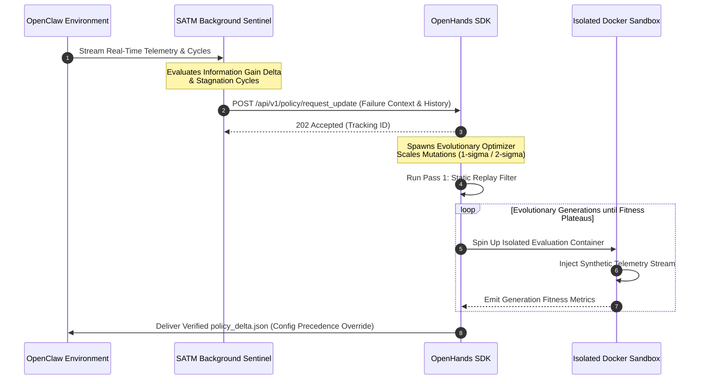

# Anvil Software Requirements Specification: RL Policy Amendment Loop (v1.0.0)

## 1. Introduction & Schema Definitions
This Software Requirements Specification (SRS) establishes the deterministic technical contracts, interface architectures, and schema structures for the Autonomous Reinforcement Learning Policy Amendment Engine within the Anvil ecosystem.

### 1.1 Data Model: State Machine State Registry ($SM_n$)
The system state machine state representation must explicitly adhere to the following strict JSON schema definition:

```json
{
  "$schema": "https://json-schema.org/draft/2020-12/schema",
  "title": "StateMachineStateRegistry",
  "type": "object",
  "required": ["state_id", "timestamp", "phase_id", "execution_cycle_count", "global_objectives", "telemetry_metrics"],
  "properties": {
    "state_id": { "type": "string", "pattern": "^SM_[a-zA-Z0-9_]+$" },
    "timestamp": { "type": "string", "format": "date-time" },
    "phase_id": { "type": "string", "pattern": "^PHASE_[0-9]+$" },
    "execution_cycle_count": { "type": "integer", "minimum": 0 },
    "global_objectives": {
      "type": "object",
      "required": ["task_completion_rate", "token_efficiency_weight", "latency_threshold_ms"],
      "properties": {
        "task_completion_rate": { "type": "number", "minimum": 0.0, "maximum": 1.0 },
        "token_efficiency_weight": { "type": "number", "minimum": 0.0, "maximum": 1.0 },
        "latency_threshold_ms": { "type": "integer", "minimum": 1 }
      }
    },
    "telemetry_metrics": {
      "type": "object",
      "required": ["error_rate", "information_gain_delta", "sensory_friction_index"],
      "properties": {
        "error_rate": { "type": "number", "minimum": 0.0 },
        "information_gain_delta": { "type": "number" },
        "sensory_friction_index": { "type": "number", "minimum": 0.0 }
      }
    }
  }
}
```

## 2. Interface Contracts & API Specifications

### 2.1 Policy Request Endpoint: OpenClaw to OpenHands SDK
- **Endpoint URL:** `POST http://localhost:8080/api/v1/policy/request_update`
- **Headers:** `Content-Type: application/json`
- **Payload Contract:**
```json
{
  "trigger_source": "SATM_BOREDOM_SIGNAL",
  "current_state_id": "SM_SAND_TRANSITION_01",
  "historical_sequence": ["SM_GRASS_03", "SM_GRASS_04", "SM_SAND_TRANSITION_01"],
  "active_telemetry_snapshot": {
    "error_rate": 0.78,
    "information_gain_delta": 0.002,
    "sensory_friction_index": 4.12
  },
  "raw_sensory_log_path": "logs/telemetry/run_failure_20260517.json"
}
```
- **Response Contract (202 Accepted):**
```json
{
  "request_id": "req-98765-es-loop",
  "status": "QUEUED_FOR_OPTIMIZATION",
  "estimated_time_seconds": 45,
  "telemetry_sieve_profile": "RESTRICTED_SANDBOX"
}
```



## 3. Detailed Functional Requirements

### 3.1 Self-Awareness & Telemetry Monitor (SATM) Execution
- **REQ-SATM-010:** The SATM module shall run continuously as a lightweight background observer thread decoupled from OpenClaw's primary blocking execution stack.
- **REQ-SATM-011:** The SATM shall compute the rolling value of Information Gain ($\Delta I$) every $100	ext{ms}$. If $\Delta I \le 0.005$ across 50 consecutive operational cycles while state machine transition logs indicate active resource utilization, the SATM must dispatch a `SATM_BOREDOM_SIGNAL` to trigger optimization.
- **REQ-SATM-012:** The SATM shall track the logical entropy of state mutations. If a state transition path toggles cyclically between a closed cluster of states ($SM_A \leftrightarrow SM_B$) without advancing to downstream system milestones within 10 iterations, the system shall assert an immediate `SATM_DEADLOCK_SIGNAL`.

### 3.2 Evolutionary Engine Mutation Boundaries
- **REQ-EVO-020:** The reasoning engine shall compute candidate offspring sizes dynamically, restricting standard population baselines to $10 \le P_{size} \le 20$ to maintain token and compute boundaries.
- **REQ-EVO-021:** When processing an unknown state transition boundary error (`SATM_NOVELTY_SIGNAL`), the engine's mutation operator must enforce a broad $\pm2\sigma$ structural rewrite of state path routing matrix keys to map the new terrain.
- **REQ-EVO-022:** When correcting smooth execution drift (`SATM_DRIFT_SIGNAL`), the engine must enforce a narrow $\pm1\sigma$ variation restricted strictly to continuous numerical weight modifications.
- **REQ-EVO-023:** The optimization algorithm shall apply elitist selection mechanisms, carrying forward the top $10\%$ highest-performing genomes completely unchanged into the subsequent generation.

### 3.3 Sandbox Isolation & Defensive Resource Constraints
- **REQ-SND-030:** All dynamic telemetry rollout simulations must execute within ephemeral, headless Docker execution containers managed via the OpenHands client interface.
- **REQ-SND-031:** The dynamic sandbox container lifecycle must be bounded by a hard execution timeout limit of $15000	ext{ms}$. Any candidate execution exceeding this threshold must be automatically terminated, logged as a terminal failure, and assigned an absolute zero fitness score.
- **REQ-SND-032:** Network access inside the simulation sandbox shall be set to `strict` mode, fully blocking external internet routing and confining all validation traffic to local loopback adapters (`127.0.0.1`).

### 3.4 Termination & Verification Parameters
- **REQ-TRM-040:** The optimizer framework shall terminate an ongoing run when the rolling mean performance improvement of the fitness score across the top $30\%$ of the population drops below a slope threshold of $rac{dF}{dG} \le 0.01$ over two sequential generations.
- **REQ-TRM-041:** Upon reaching convergence confirmation, the system must perform a cryptographic signature check and structure validation pass against the proposed `policy_delta.json` file prior to staging deployment to the production OpenClaw registry.

## 4. Architectural Traceability & Gap Analysis
A detailed verification matrix mapping shows complete logical continuity between the initial functional goals and these specification constructs:
- **Proposal §3 (Triggers) $
ightarrow$ SRS §2.1 & §3.1:** Validates the explicit mapping of Boredom, Stagnation, and Terrain-Novelty criteria directly into JSON structures and programmatic evaluation intervals.
- **Proposal §4.2 ($\sigma$-Scaling) $
ightarrow$ SRS §3.2:** Explicitly codifies the operational meaning of $\pm1\sigma$ local tweaks vs. $\pm2\sigma$ macroscopic structure mutation constraints.
- **Proposal §5 (Sandbox Separation) $
ightarrow$ SRS §3.3:** Defines defensive time boundaries ($15	ext{s}$ ceiling) and local loopback limits ensuring compliance with Anvil's token optimization directives.