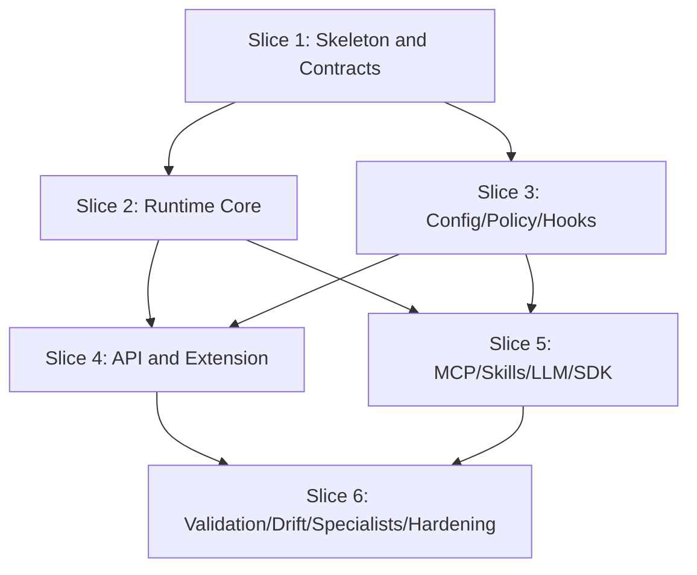

# Anvil Implementation Plan (v0.1.0)

## 1. Overview

This plan defines the implementation slices for Anvil v0.1.0 based on the approved proposal, specification, architecture, and blueprint. It is structured to preserve the design chain (proposal -> spec -> architecture -> blueprint -> plan -> code), enforce no-drift execution, and guarantee test-first quality gates.

Execution constraints:
- No source or test module may be introduced without mapping to a blueprint module or explicit documented delta.
- Each slice ships with unit, integration, and end-to-end tests.
- After each slice, run full test suites and fix failures before moving forward.
- Implementation and QA ownership boundaries from the spec remain strict.

Delivery target:
- Reach implementation-ready state for all modules in the blueprint.
- Maintain at least 70% LOC coverage by the end of implementation, with higher risk areas targeted at 85%+.

## 2. Implementation Slices

### 2.1 Slice 1: Project Skeleton and Contracts

Status: ✅ COMPLETED (2026-05-31)
Execution Mode: SERIAL (hard prerequisite)

Completion notes:
- Runtime + extension + tests scaffolds created; all Slice 1 modules from the
  §8 assignment matrix implemented with no unmapped modules (no drift).
- Python suite: 48 passed, 99% coverage on `anvil_runtime` (≥70%/≥85% met).
- Tooling locked: vitest (TS) + pytest/pytest-cov/httpx (Python).
- Carry-forward: the TypeScript vitest suite is written to spec but could not be
  executed in the authoring environment (no Node.js/npm installed) — must run
  before Slice 4 sign-off. PEP 604 union syntax kept verbatim via
  `eval_type_backport` on the local Python 3.9 (inert on the 3.12 baseline).
- Details: see `logs/implementation.log`.

Objective:
- Stand up repository structure for `extension/`, `runtime/`, and `tests/`.
- Implement shared contracts, schemas, and constants that every later slice depends on.

Primary tasks:
1. Create runtime package scaffold (`runtime/anvil_runtime/*`) and extension scaffold (`extension/src/*`).
2. Implement API model contracts in `runtime/anvil_runtime/api/models.py`.
3. Implement config schemas/constants in `runtime/anvil_runtime/config/schema.py` and `extension/src/config/modeSelector.ts`.
4. Implement base phase abstractions in `runtime/anvil_runtime/agents/base_phase_agent.py` and `runtime/anvil_runtime/core/phase_contracts.py`.
5. Add deterministic event envelope and run-state schemas.

Expected artifacts:
- Runtime and extension skeleton directories from blueprint.
- Core contract modules compiling/linting cleanly.
- Initial tests validating schema correctness and import integrity.

Completion criteria:
- All skeleton modules exist and pass static checks.
- Contract tests pass.
- No unresolved import or type errors.

Tests required in this slice:
- Unit:
	- `tests/unit/runtime/test_api_models.py`
	- `tests/unit/runtime/test_config_schema.py`
	- `tests/unit/runtime/test_phase_contracts.py`
	- `tests/unit/extension/test_mode_selector.ts`
- Integration:
	- `tests/integration/api/test_model_validation.py`
- E2E:
	- `tests/e2e/bootstrap/test_scaffold_boots.py`

---

### 2.2 Slice 2: Runtime Core Orchestration

Status: ✅ COMPLETED (2026-05-31)
Execution Mode: PARALLELIZABLE (after Slice 1) — executed serially per proposal §8.6

Completion notes:
- DevelopmentManager supervisor (start/dispatch/run_until_pause, secure+gated
  approval gates, bounded retries→escalation, rollback, checkpoint resume),
  PhaseDAG (linear pipeline), PhaseRegistry, RetryController, EscalationService,
  EventBus, CheckpointStore, RunSummaryWriter, PhaseAgentFactory, and 12 phase
  stubs — all from the §8 matrix, no unmapped modules (no drift).
- Tests: 76 passed total (28 new), 95% coverage; core ≈93%, state ≈91% (≥85% met).
- Carry-forward: phase agents are stubs until Slice 5; artifact-existence
  (FR-SV-009) and post-phase drift (FR-SV-010) enforcement land in Slice 6.
- Details: see `logs/implementation.log`.

Objective:
- Build the development manager, phase DAG/registry, retry/escalation controls, and checkpoint lifecycle.

Primary tasks:
1. Implement supervisor orchestration in `runtime/anvil_runtime/core/development_manager.py`.
2. Implement DAG sequencing in `runtime/anvil_runtime/core/phase_dag.py` and phase lookup in `runtime/anvil_runtime/core/phase_registry.py`.
3. Implement retry/backoff and escalation flow in `runtime/anvil_runtime/core/retry_controller.py` and `runtime/anvil_runtime/core/escalation_service.py`.
4. Implement run-state persistence in `runtime/anvil_runtime/state/checkpoint_store.py`.
5. Emit lifecycle events through `runtime/anvil_runtime/state/event_bus.py` and `runtime/anvil_runtime/state/run_summary.py`.

Expected artifacts:
- Working supervisor state machine that can advance and pause by mode.
- Resume-from-checkpoint capability with invalid-checkpoint fallback.

Completion criteria:
- Phase progression honors DAG and mode gates.
- Retries/escalations behave per configured limits.
- Resume logic validated by automated tests.

Tests required in this slice:
- Unit:
	- `tests/unit/runtime/test_phase_dag.py`
	- `tests/unit/runtime/test_development_manager.py`
	- `tests/unit/runtime/test_retry_controller.py`
	- `tests/unit/runtime/test_checkpoint_store.py`
- Integration:
	- `tests/integration/phase_flow/test_secure_gate_pause.py`
	- `tests/integration/phase_flow/test_resume_with_invalid_checkpoint.py`
- E2E:
	- `tests/e2e/checkpoint_resume/test_resume_after_restart.py`

---

### 2.3 Slice 3: Config, Runtime Projection, Policy, and Hooks

Status: ✅ COMPLETED (2026-05-31)
Execution Mode: PARALLELIZABLE (after Slice 1) — executed serially per proposal §8.6

Completion notes:
- Config 4-level precedence (scalar override / list union / deep map merge),
  loader (YAML), validator (version + consistency), runtime projection writer
  (.openhands/runtime/* + hooks.json + logs/), policy engine + rule evaluator +
  remediation (switch-to-allowed-model), and hook compiler/adapter
  (allow/deny/mutate + audit) — all from the §8 matrix, no unmapped modules.
- Tests: 106 passed total (30 new), 94% coverage; config ≈96%, policy ≈90%,
  hooks ≈93% (≥85% met).
- Carry-forward: policy/hook engines not yet wired into DevelopmentManager
  dispatch — that wiring lands with Slice 4 (API) / Slice 5 (OpenHands adapter).
- Details: see `logs/implementation.log`.

Objective:
- Implement effective configuration resolution, runtime projection writing, policy enforcement, and lifecycle hook enforcement.

Primary tasks:
1. Implement loaders/mergers/validators in:
	 - `runtime/anvil_runtime/config/loader.py`
	 - `runtime/anvil_runtime/config/merger.py`
	 - `runtime/anvil_runtime/config/validator.py`
2. Implement projection output in `runtime/anvil_runtime/config/projection.py`.
3. Implement policy engine/rules/remediation:
	 - `runtime/anvil_runtime/policy/engine.py`
	 - `runtime/anvil_runtime/policy/rule_evaluator.py`
	 - `runtime/anvil_runtime/policy/remediation.py`
4. Implement hook compiler/adapter/lifecycle handlers:
	 - `runtime/anvil_runtime/hooks/compiler.py`
	 - `runtime/anvil_runtime/hooks/adapter.py`
	 - `runtime/anvil_runtime/hooks/lifecycle_hooks.py`

Expected artifacts:
- Correct precedence merge behavior (scalar override, list union, deep map merge).
- Runtime projection files produced under `.openhands/`, `.anvil/`, and `logs/`.
- Enforced policy/hook decisions with auditable events.

Completion criteria:
- Policy violations remediated or escalated deterministically.
- Hook callbacks applied at all required lifecycle boundaries.
- Projection output reproducible across runs.

Tests required in this slice:
- Unit:
	- `tests/unit/runtime/test_config_merger.py`
	- `tests/unit/runtime/test_projection_writer.py`
	- `tests/unit/runtime/test_policy_engine.py`
	- `tests/unit/runtime/test_hook_adapter.py`
- Integration:
	- `tests/integration/policy/test_forbidden_model_remediation.py`
	- `tests/integration/policy/test_hook_enforcement.py`
- E2E:
	- `tests/e2e/security_profile/test_restricted_policy_flow.py`

---

### 2.4 Slice 4: API Surface and Extension Client

Status: ✅ COMPLETED (2026-05-31)
Execution Mode: SERIAL GATE (requires Slices 2 and 3 complete)

Completion notes:
- Runtime `/v1` surface: FastAPI app factory (`app.py`), dependency providers
  (`api/deps.py`), and routers for runs/approve/override (`routes_runs.py`),
  SSE events (`routes_events.py`), artifact lookup (`routes_artifacts.py`), and
  health (`routes_health.py`), plus the runtime secret adapter with env fallback
  (`security/secret_adapter.py`). All from the §8 matrix, no unmapped modules.
- Extension thin client: typed `runtimeClient.ts`, `eventStreamClient.ts`
  (SSE decoder), `healthProbe.ts`, chat `participant.ts`/`commandRouter.ts`/
  `responseRenderer.ts`, UI `statusBar.ts`/`approvals.ts`/`escalationPrompt.ts`,
  `secrets/secretStore.ts`/`redactionClient.ts`, and `telemetry/extensionLogger.ts`/
  `eventMapper.ts`. `extension.ts` activation now registers the participant
  (the Slice 1 scaffold explicitly deferred this wiring to Slice 4).
- Python tests: 137 passed total (31 new); API package coverage ≈98% (routes
  98–100%, deps 93%, secret_adapter 100%), overall 94% (≥80% API / ≥70% overall met).
- Carry-forward: the TypeScript suites (`test_runtime_client.ts`,
  `test_command_router.ts`) are written to spec but NOT executed here — Node.js/
  npm remain unavailable in the authoring environment (Slice 1 carry-forward).
  Policy/hook engines and the secret adapter are reachable but their dispatch
  wiring lands in Slice 5 (OpenHands adapter / LLM routing).
- Details: see `logs/implementation.log`.

Objective:
- Implement REST API routes and connect the VS Code participant client, including approvals and event streaming UX.

Primary tasks:
1. Build FastAPI app and routes:
	 - `runtime/anvil_runtime/app.py`
	 - `runtime/anvil_runtime/api/routes_runs.py`
	 - `runtime/anvil_runtime/api/routes_events.py`
	 - `runtime/anvil_runtime/api/routes_artifacts.py`
	 - `runtime/anvil_runtime/api/routes_health.py`
2. Implement extension runtime clients:
	 - `extension/src/runtime/runtimeClient.ts`
	 - `extension/src/runtime/eventStreamClient.ts`
	 - `extension/src/runtime/healthProbe.ts`
3. Implement chat and UI surfaces:
	 - `extension/src/chat/participant.ts`
	 - `extension/src/chat/commandRouter.ts`
	 - `extension/src/chat/responseRenderer.ts`
	 - `extension/src/ui/statusBar.ts`
	 - `extension/src/ui/approvals.ts`
	 - `extension/src/ui/escalationPrompt.ts`
4. Implement secret handling bridge:
	 - `extension/src/secrets/secretStore.ts`
	 - `runtime/anvil_runtime/security/secret_adapter.py`

Expected artifacts:
- Fully reachable `/v1/*` API surface.
- Working extension-to-runtime request path.
- SSE-driven run status updates and approval prompts.

Completion criteria:
- Contract tests pass for all API endpoints.
- Extension command flows can start, approve, override, and observe a run.
- Secret retrieval path validated for both Secret Storage and env fallback.

Tests required in this slice:
- Unit:
	- `tests/unit/extension/test_runtime_client.ts`
	- `tests/unit/extension/test_command_router.ts`
	- `tests/unit/runtime/test_routes_validation.py`
- Integration:
	- `tests/integration/api/test_runs_endpoints.py`
	- `tests/integration/api/test_events_stream.py`
	- `tests/integration/api/test_health_endpoint.py`
- E2E:
	- `tests/e2e/secure_mode_run/test_secure_approval_journey.py`

---

### 2.5 Slice 5: Tools, Skills, LLM Routing, and OpenHands Adapter

Status: NOT STARTED
Execution Mode: PARALLELIZABLE (requires Slices 2 and 3 complete)

Objective:
- Implement external tool integration, progressive skill loading, model routing, and OpenHands execution bridge.

Primary tasks:
1. Implement MCP integration and authorization:
	 - `runtime/anvil_runtime/tools/mcp_manager.py`
	 - `runtime/anvil_runtime/tools/mcp_cache.py`
	 - `runtime/anvil_runtime/tools/tool_authorizer.py`
	 - `runtime/anvil_runtime/tools/core_tools.py`
2. Implement skills loading/resolution:
	 - `runtime/anvil_runtime/skills/loader.py`
	 - `runtime/anvil_runtime/skills/resolver.py`
	 - `runtime/anvil_runtime/skills/manifest.py`
3. Implement OpenRouter provider and router:
	 - `runtime/anvil_runtime/llm/openrouter_provider.py`
	 - `runtime/anvil_runtime/llm/model_router.py`
	 - `runtime/anvil_runtime/llm/usage_tracker.py`
4. Implement OpenHands adapter:
	 - `runtime/anvil_runtime/sdk/openhands_adapter.py`
	 - `runtime/anvil_runtime/sdk/session_bridge.py`

Expected artifacts:
- Tool discovery/cache/fallback semantics implemented.
- Policy-aware model routing by phase/subtask.
- OpenHands session bridge wired for phase execution.

Completion criteria:
- MCP invocation obeys security profile rules.
- Skill loading is phase-scoped only.
- Model usage telemetry emitted and budget checks enforced.

Tests required in this slice:
- Unit:
	- `tests/unit/runtime/test_mcp_authorization.py`
	- `tests/unit/runtime/test_skill_loader.py`
	- `tests/unit/runtime/test_model_router.py`
	- `tests/unit/runtime/test_usage_tracker.py`
- Integration:
	- `tests/integration/policy/test_mcp_restricted_profile.py`
	- `tests/integration/runtime/test_openhands_adapter_session.py`
- E2E:
	- `tests/e2e/tools_and_models/test_mcp_timeout_fallback.py`

---

### 2.6 Slice 6: Artifact Validation, Drift Control, Specialist Roles, and Hardening

Status: NOT STARTED
Execution Mode: SERIAL FINALIZATION (requires Slices 4 and 5 complete)

Objective:
- Finalize artifact validation, drift remediation, specialist-role extensibility, and production hardening before packaging/doc/deployment phases.

Primary tasks:
1. Implement artifact validators and metadata processing:
	 - `runtime/anvil_runtime/artifacts/validator.py`
	 - `runtime/anvil_runtime/artifacts/schemas.py`
	 - `runtime/anvil_runtime/artifacts/metadata.py`
2. Implement drift detection/classification/remediation:
	 - `runtime/anvil_runtime/drift/checker.py`
	 - `runtime/anvil_runtime/drift/classifier.py`
	 - `runtime/anvil_runtime/drift/remediation.py`
3. Implement specialist role registry handling:
	 - `runtime/anvil_runtime/agents/specialist_registry.py`
4. Harden observability and redaction:
	 - `runtime/anvil_runtime/security/redaction.py`
	 - `runtime/anvil_runtime/state/event_bus.py` final event completeness pass

Expected artifacts:
- Deterministic artifact validation and drift reports.
- Specialist role loading and bounded invocation.
- Complete audit event coverage with redaction.

Completion criteria:
- Drift checks run in required order and severity routes work.
- Specialist behavior is backward-compatible when registry absent.
- Final regression suite green.

Tests required in this slice:
- Unit:
	- `tests/unit/runtime/test_artifact_validator.py`
	- `tests/unit/runtime/test_drift_checker.py`
	- `tests/unit/runtime/test_specialist_registry.py`
	- `tests/unit/runtime/test_redaction.py`
- Integration:
	- `tests/integration/phase_flow/test_phase_artifact_validation_failures.py`
	- `tests/integration/runtime/test_specialist_invocation_boundaries.py`
- E2E:
	- `tests/e2e/drift_remediation/test_major_drift_rollback.py`
	- `tests/e2e/full_run/test_secure_mode_full_12_phase_run.py`

## 3. Dependency Graph and Sequencing



Execution order:
1. Slice 1
2. Slice 2 and Slice 3 (run in parallel workstreams)
3. Slice 4 and Slice 5 (run in parallel workstreams)
5. Slice 6

Each transition requires:
- Full test pass (unit + integration + e2e)
- Drift check against blueprint/architecture/spec
- Update to `logs/implementation.log`

### 3.1 Parallelization Labels

| Slice | Label | Reason |
|---|---|---|
| Slice 1 | SERIAL | Establishes contracts/scaffold all later slices import. |
| Slice 2 | PARALLEL LANE A | Depends only on Slice 1 outputs. |
| Slice 3 | PARALLEL LANE B | Depends only on Slice 1 outputs. |
| Slice 4 | SERIAL GATE | Requires orchestration from Slice 2 and policy/config/hook behavior from Slice 3. |
| Slice 5 | PARALLEL LANE C | Can start once Slices 2 and 3 are done; does not require Slice 4 completion. |
| Slice 6 | SERIAL FINAL | Requires validated outputs from Slices 4 and 5. |

### 3.2 Recommended Parallel Execution Schedule

Wave 1 (serial bootstrap):
- Run Slice 1 alone.

Wave 2 (parallel lanes):
- Run Slice 2 and Slice 3 in parallel.

Wave 3 (mixed):
- Start Slice 4 and Slice 5 in parallel after both Slice 2 and Slice 3 are complete.

Wave 4 (serial convergence):
- Run Slice 6 after Slice 4 and Slice 5 both pass their slice gates.

### 3.3 Within-Slice Parallel Opportunities

These are optional internal parallel tracks that do not violate slice dependencies:

| Slice | Internal Parallel Tracks |
|---|---|
| Slice 2 | (A) `core/*` orchestration + retries, (B) `state/*` checkpoint/event plumbing, (C) phase agent stubs under `agents/phases/*` |
| Slice 3 | (A) `config/*` merge/validate/projection, (B) `policy/*` rules/remediation, (C) `hooks/*` adapter/compiler |
| Slice 4 | (A) runtime API routes in `api/routes_*.py`, (B) extension runtime clients in `extension/src/runtime/*`, (C) chat/UI flows in `extension/src/chat/*` and `extension/src/ui/*` |
| Slice 5 | (A) `tools/*` MCP stack, (B) `skills/*`, (C) `llm/*` routing/usage, (D) `sdk/*` OpenHands adapter |
| Slice 6 | (A) `artifacts/*`, (B) `drift/*`, (C) specialist registry hardening, (D) redaction/completeness pass in `state/*` |

### 3.4 Parallel Work Guardrails

1. Any parallel lane must respect the module-to-slice assignment matrix in Section 8.
2. Shared contract files from Slice 1 are immutable except by coordinated change with all active lanes.
3. Merge order for parallel branches should be: Slice 2 first, Slice 3 second, then Slice 4 and Slice 5, then Slice 6.
4. Before merging each parallel lane, run full unit/integration/e2e suites plus drift check.

### 3.5 Hierarchy Clarification

Execution hierarchy for this factory is:
1. Phase level (factory lifecycle): Proposal -> Spec -> Architecture -> Blueprint -> Plan -> Implementation -> QA/Packaging/Documentation/Deployment/Cleanup.
2. Slice level (implementation decomposition): Slice 1 through Slice 6 under the Implementation phase.
3. Wave level (implementation scheduling): execution batches that group one or more slices based on dependency readiness.

Important interpretation:
- Waves are not new factory phases.
- Waves exist only to schedule implementation slices in serial or parallel.

### 3.6 Parallelization Decision Protocol (How Execution Decides)

Parallelization is not ad hoc. It is decided using the following deterministic gate checks at runtime.

Decision owner:
- The development-manager implementation controller (implemented during Slice 2) evaluates slice readiness and assigns execution to a serial lane or parallel lane.

Input signals for each slice decision:
1. Dependency readiness:
	 - All prerequisite slices marked COMPLETE.
2. Quality readiness:
	 - Latest full test suite pass for prerequisite slices.
	 - No unresolved major/critical drift.
3. Contract safety:
	 - No planned edits outside the slice's module assignment matrix (Section 8).
4. Shared-file contention:
	 - No simultaneous parallel edits to protected shared files:
		 - `runtime/anvil_runtime/core/phase_contracts.py`
		 - `runtime/anvil_runtime/api/models.py`
		 - `runtime/anvil_runtime/config/schema.py`
		 - any file explicitly marked shared in implementation logs.

Go/No-Go rules:
1. A slice can start only if dependency readiness is true.
2. A slice can run in parallel only if quality readiness, contract safety, and shared-file contention checks are all true.
3. If any parallel check fails, the slice is downgraded to serial execution and queued.
4. If a running parallel slice introduces drift or failing quality gates, the wave halts and reverts to serial recovery for affected slices.

Wave start criteria:
- Wave 1 starts when Plan phase is approved.
- Wave 2 starts only after Slice 1 is COMPLETE and its gates pass.
- Wave 3 starts only after Slice 2 and Slice 3 are COMPLETE and their gates pass.
- Wave 4 starts only after Slice 4 and Slice 5 are COMPLETE and their gates pass.

Merge and integration decision rules:
1. Parallel lanes merge only after each lane independently passes full tests and drift check.
2. After lane merges, run a combined full regression suite before opening the next wave.
3. If combined regression fails, suspend next-wave start and fix on the integration branch.

Operational pseudo-flow:

```text
for wave in [W1, W2, W3, W4]:
	wait until wave prerequisites are complete
	for slice in wave:
		if deps_ready(slice) and quality_ready(slice) and contract_safe(slice) and no_contention(slice):
			schedule(slice, parallel=True)
		else:
			schedule(slice, parallel=False)
	execute scheduled slices
	require full regression + drift checks
	if checks fail: recover serially, then re-run gates
```

## 4. Test Strategy

Quality gates per slice:
1. Unit tests: verify deterministic business logic and schema boundaries.
2. Integration tests: verify component interoperability (API, policy, hooks, checkpoints).
3. E2E tests: verify full run behavior and user-facing approval/resume/escalation paths.

Test execution policy:
- Run full test suite after each slice.
- On failure, fix and rerun up to 5 attempts before escalation to user.
- Keep slice-level coverage trending and enforce final >= 70% LOC project-wide.

Coverage targets:
- `runtime/anvil_runtime/core/*`: >= 85%
- `runtime/anvil_runtime/policy/*`: >= 85%
- `runtime/anvil_runtime/state/*`: >= 85%
- `runtime/anvil_runtime/api/*`: >= 80%
- `extension/src/*`: >= 70%
- Overall project LOC: >= 70%

Tooling baseline (to be finalized during implementation):
- Python: `pytest`, `pytest-cov`, `httpx` test client
- TypeScript: `vitest` or `jest` (final choice in Slice 1)
- E2E: Python-driven scenario tests with service + extension interaction harness

## 5. Risk Mitigation

| Risk | Impact | Mitigation | Trigger |
|---|---|---|---|
| OpenHands SDK callback shape mismatch | Integration delays | Create adapter contract tests in Slice 5 before full wiring | First adapter test failure |
| MCP servers flaky or slow | Runtime instability | Cache-based fallback, timeout budgeting, retry with clear escalation | Discovery timeout > configured threshold |
| Drift between docs and code | Rework and approval delay | Enforce post-slice drift checks and no unplanned modules policy | New module not mapped to blueprint |
| Extension/runtime contract drift | Broken UX | Keep generated OpenAPI and typed client contract tests | API response schema mismatch |
| Secret leakage in logs | Security issue | Mandatory redaction tests and centralized event bus write path | Any secret-pattern match in logs |
| Coverage drops below threshold | Quality regression | CI coverage gates + per-slice remediation tasks | Coverage < 70% overall |

## 6. Success Criteria

The implementation plan is successful when:
1. All six slices complete with acceptance criteria satisfied.
2. Every blueprint module is implemented or explicitly deferred with approved rationale.
3. Full automated test suite passes at each slice boundary and final run.
4. Final coverage meets or exceeds 70% LOC overall.
5. No unresolved major/critical drift remains against blueprint/architecture/spec.
6. `logs/implementation.log` captures slice-by-slice execution details.

## 7. Gap Analysis (Blueprint vs. Plan)

| Blueprint Area | Plan Coverage | Status | Notes |
|---|---|---|---|
| Runtime core modules (`core/*`) | Slice 2 | Closed | Includes DAG, retries, escalations, orchestration |
| API modules (`api/*`, `app.py`) | Slice 4 | Closed | Includes all `/v1` endpoints and validation |
| Agent framework and phase agents (`agents/*`) | Slices 1, 2, 6 | Closed | Base contracts first, specialist hardening later |
| Config/projection modules (`config/*`) | Slices 1, 3 | Closed | Schema first, merge/projection then |
| Policy and hooks modules (`policy/*`, `hooks/*`) | Slice 3 | Closed | Includes remediation and lifecycle adapter |
| State/observability modules (`state/*`) | Slices 2, 6 | Closed | Event bus early, completeness hardening late |
| Tools/skills/LLM/SDK (`tools/*`, `skills/*`, `llm/*`, `sdk/*`) | Slice 5 | Closed | Centralized in one integration slice |
| Security modules (`security/*`) | Slices 4, 6 | Closed | Secret adapter then redaction hardening |
| Extension client modules (`extension/src/*`) | Slices 1, 4 | Closed | Scaffolding then full chat/runtime UX |
| Test structure (`tests/unit`, `tests/integration`, `tests/e2e`) | All slices | Closed | Unit + integration + e2e mandated per slice |

Residual controlled gaps:
- Final TypeScript test runner choice is deferred to Slice 1.
- CI pipeline configuration details are intentionally left to implementation execution tasks.

## 8. Blueprint Module to Slice Assignment Matrix

This matrix is the no-drift assignment source of truth for implementation.

| Module/Folder | Assigned Slice |
|---|---|
| `runtime/anvil_runtime/__init__.py` | Slice 1 |
| `runtime/anvil_runtime/app.py` | Slice 4 |
| `runtime/anvil_runtime/api/deps.py` | Slice 4 |
| `runtime/anvil_runtime/api/models.py` | Slice 1 |
| `runtime/anvil_runtime/api/routes_runs.py` | Slice 4 |
| `runtime/anvil_runtime/api/routes_artifacts.py` | Slice 4 |
| `runtime/anvil_runtime/api/routes_health.py` | Slice 4 |
| `runtime/anvil_runtime/api/routes_events.py` | Slice 4 |
| `runtime/anvil_runtime/core/development_manager.py` | Slice 2 |
| `runtime/anvil_runtime/core/phase_dag.py` | Slice 2 |
| `runtime/anvil_runtime/core/phase_registry.py` | Slice 2 |
| `runtime/anvil_runtime/core/phase_contracts.py` | Slice 1 |
| `runtime/anvil_runtime/core/retry_controller.py` | Slice 2 |
| `runtime/anvil_runtime/core/escalation_service.py` | Slice 2 |
| `runtime/anvil_runtime/agents/base_phase_agent.py` | Slice 1 |
| `runtime/anvil_runtime/agents/factory.py` | Slice 2 |
| `runtime/anvil_runtime/agents/specialist_registry.py` | Slice 6 |
| `runtime/anvil_runtime/agents/phase_invocation.py` | Slice 2 |
| `runtime/anvil_runtime/agents/phases/proposal_agent.py` | Slice 2 |
| `runtime/anvil_runtime/agents/phases/factory_init_agent.py` | Slice 2 |
| `runtime/anvil_runtime/agents/phases/specification_agent.py` | Slice 2 |
| `runtime/anvil_runtime/agents/phases/architecture_agent.py` | Slice 2 |
| `runtime/anvil_runtime/agents/phases/blueprint_agent.py` | Slice 2 |
| `runtime/anvil_runtime/agents/phases/dev_plan_agent.py` | Slice 2 |
| `runtime/anvil_runtime/agents/phases/implementation_agent.py` | Slice 2 |
| `runtime/anvil_runtime/agents/phases/qa_agent.py` | Slice 2 |
| `runtime/anvil_runtime/agents/phases/packaging_agent.py` | Slice 2 |
| `runtime/anvil_runtime/agents/phases/documentation_agent.py` | Slice 2 |
| `runtime/anvil_runtime/agents/phases/deployment_agent.py` | Slice 2 |
| `runtime/anvil_runtime/agents/phases/cleanup_agent.py` | Slice 2 |
| `runtime/anvil_runtime/config/loader.py` | Slice 3 |
| `runtime/anvil_runtime/config/merger.py` | Slice 3 |
| `runtime/anvil_runtime/config/validator.py` | Slice 3 |
| `runtime/anvil_runtime/config/projection.py` | Slice 3 |
| `runtime/anvil_runtime/config/schema.py` | Slice 1 |
| `runtime/anvil_runtime/policy/engine.py` | Slice 3 |
| `runtime/anvil_runtime/policy/models.py` | Slice 1 |
| `runtime/anvil_runtime/policy/remediation.py` | Slice 3 |
| `runtime/anvil_runtime/policy/rule_evaluator.py` | Slice 3 |
| `runtime/anvil_runtime/hooks/adapter.py` | Slice 3 |
| `runtime/anvil_runtime/hooks/compiler.py` | Slice 3 |
| `runtime/anvil_runtime/hooks/lifecycle_hooks.py` | Slice 3 |
| `runtime/anvil_runtime/artifacts/validator.py` | Slice 6 |
| `runtime/anvil_runtime/artifacts/schemas.py` | Slice 6 |
| `runtime/anvil_runtime/artifacts/metadata.py` | Slice 6 |
| `runtime/anvil_runtime/drift/checker.py` | Slice 6 |
| `runtime/anvil_runtime/drift/classifier.py` | Slice 6 |
| `runtime/anvil_runtime/drift/remediation.py` | Slice 6 |
| `runtime/anvil_runtime/state/event_bus.py` | Slices 2 and 6 |
| `runtime/anvil_runtime/state/checkpoint_store.py` | Slice 2 |
| `runtime/anvil_runtime/state/run_summary.py` | Slice 2 |
| `runtime/anvil_runtime/tools/mcp_manager.py` | Slice 5 |
| `runtime/anvil_runtime/tools/mcp_cache.py` | Slice 5 |
| `runtime/anvil_runtime/tools/core_tools.py` | Slice 5 |
| `runtime/anvil_runtime/tools/tool_authorizer.py` | Slice 5 |
| `runtime/anvil_runtime/skills/loader.py` | Slice 5 |
| `runtime/anvil_runtime/skills/resolver.py` | Slice 5 |
| `runtime/anvil_runtime/skills/manifest.py` | Slice 5 |
| `runtime/anvil_runtime/llm/openrouter_provider.py` | Slice 5 |
| `runtime/anvil_runtime/llm/model_router.py` | Slice 5 |
| `runtime/anvil_runtime/llm/usage_tracker.py` | Slice 5 |
| `runtime/anvil_runtime/sdk/openhands_adapter.py` | Slice 5 |
| `runtime/anvil_runtime/sdk/session_bridge.py` | Slice 5 |
| `runtime/anvil_runtime/security/secret_adapter.py` | Slice 4 |
| `runtime/anvil_runtime/security/redaction.py` | Slice 6 |
| `extension/src/extension.ts` | Slice 1 |
| `extension/src/chat/participant.ts` | Slice 4 |
| `extension/src/chat/commandRouter.ts` | Slice 4 |
| `extension/src/chat/responseRenderer.ts` | Slice 4 |
| `extension/src/runtime/runtimeClient.ts` | Slice 4 |
| `extension/src/runtime/eventStreamClient.ts` | Slice 4 |
| `extension/src/runtime/healthProbe.ts` | Slice 4 |
| `extension/src/ui/statusBar.ts` | Slice 4 |
| `extension/src/ui/approvals.ts` | Slice 4 |
| `extension/src/ui/escalationPrompt.ts` | Slice 4 |
| `extension/src/secrets/secretStore.ts` | Slice 4 |
| `extension/src/secrets/redactionClient.ts` | Slice 4 |
| `extension/src/config/workspaceConfig.ts` | Slice 1 |
| `extension/src/config/modeSelector.ts` | Slice 1 |
| `extension/src/telemetry/extensionLogger.ts` | Slice 4 |
| `extension/src/telemetry/eventMapper.ts` | Slice 4 |
| `tests/unit/runtime/*` | Slices 1-6 (paired with implementation slice) |
| `tests/unit/extension/*` | Slices 1 and 4 |
| `tests/integration/*` | Slices 1-6 (paired with implementation slice) |
| `tests/e2e/*` | Slices 1-6 (paired with implementation slice) |

## 9. Operational Slice Rules

These rules are binding during implementation execution:
1. After each slice:
	 - Run all unit/integration/e2e tests.
	 - Fix failures and retry up to 5 times.
	 - If still failing after attempt 5, escalate for human guidance.
2. Perform drift check after each slice against `docs/blueprint.md`, `docs/architecture.md`, and `docs/spec.md`.
3. Record implementation journal entries in `logs/implementation.log` including:
	 - Slice objective
	 - Files changed
	 - Test outcomes
	 - Issues encountered and fixes
	 - Attempt counts
	 - Final status
4. Update this plan file after each completed slice by marking the slice as `COMPLETED` and noting the commit hash.
5. Use commit naming convention per slice, for example:
	 - `[IMPL-S1] Implement slice 1: Project skeleton and contracts`
	 - `[IMPL-S2] Implement slice 2: Runtime core orchestration`