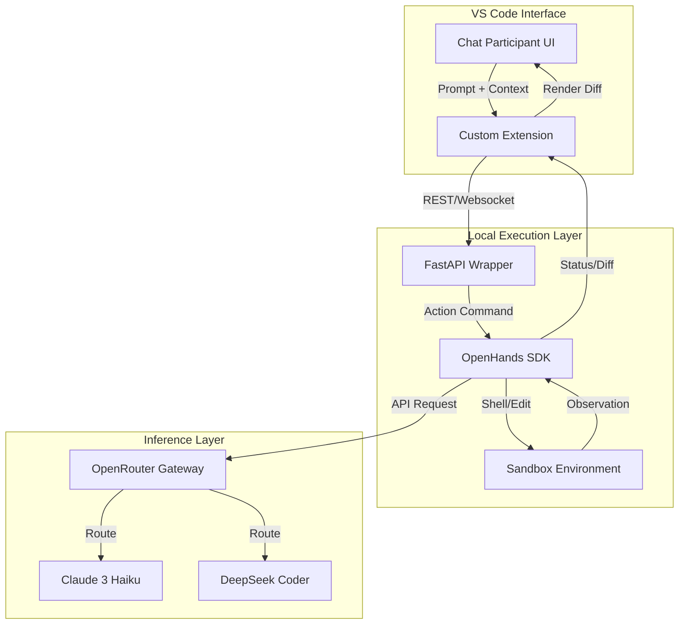

Building a custom agent with **OpenHands** and **OpenRouter** allows you to move beyond the constraints of generic tools and create a system capable of autonomous, hardware-aware reasoning.
### Custom Agent Architecture
#### 1. Architecture Components
 * **Tier 1: The Orchestration SDK (OpenHands)**: Acts as the "Agent Core" that manages the event stream, translating goals into shell commands or file edits. You can define custom runtimes here to include your specialized physics libraries.
 * **Tier 2: The Model API (OpenRouter)**: Serves as the "Reasoning Engine". It uses **Claude 3 Haiku** for low-latency tasks and **DeepSeek Coder** for complex architectural logic.
 * **Tier 3: The UI Extension (VS Code Chat Participant)**: The "Interaction Layer" that integrates with the vscode.chat.createChatParticipant API. It forwards prompts to the local OpenHands service and streams diffs back to your IDE.
#### 2. Integration Logic
 1. **SDK Layer**: Initialize OpenHands in a Dockerized runtime and configure it to use OpenRouter endpoints via LLM_CONFIG.
 2. **API Layer**: Expose a FastAPI wrapper on localhost to trigger OpenHands tasks via its Action API.
 3. **VS Code Layer**: Create a thin-client extension that captures workspace context, sends it to your API, and renders suggestions as native VS Code diffs.
#### 3. System Connectivity Diagram

#### 4. The Advantage
This setup enables you to bypass generic agent limitations by allowing **OpenHands** to interact directly with your custom build harnesses. Using **OpenRouter** ensures you can dynamically select the most efficient model for hardware-level optimizations or systemic governance.
