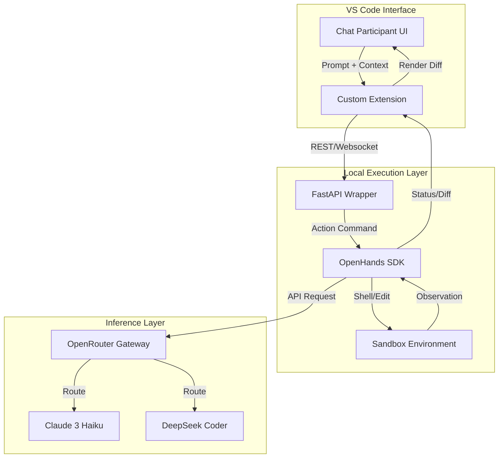

# background-information.md

## Project Overview

The goal of this project is to build a **multi‑agent, supervisor‑orchestrated software‑development factory** using the **OpenHands SDK**, running locally (e.g., inside VS Code) and backed by **OpenRouter** LLMs (such as Claude 3 Haiku and DeepSeek Coder).

This factory will automate the software‑development lifecycle from initial idea to deployment and cleanup, using a **phase‑based pipeline** and a **hierarchical agent architecture**. A top‑level **development‑manager** agent will coordinate a set of specialized phase agents, each responsible for a specific stage of the process and for producing well‑defined artifacts in the repository.

The system will support three operational modes:

- **YOLO mode** — fully autonomous, no user stops.
- **Gated mode** — user chooses which phases require approval.
- **Secure mode** — fixed mandatory checkpoints where user approval is required.

All long‑form artifacts (proposal, specifications, architecture, blueprints, plans, etc.) will be stored as **Markdown files in the `docs/` directory**.

---

## High‑Level Objectives

1. Build a **multi‑phase, agentic software‑development factory** that can be run from within VS Code using the OpenHands runtime.
2. Implement a **supervisor pattern** with a development‑manager agent that:
   - Reads user‑provided background information.
   - Manages phase progression and operational modes.
   - Delegates work to specialized phase agents.
   - Tracks and logs progress.
3. Centralize all human‑readable artifacts in the **`docs/` directory** as Markdown files.
4. Use **OpenRouter** as the LLM backend, with support for:
   - Claude 3 Haiku (planning, analysis, architecture).
   - DeepSeek Coder (code generation, refactoring, blueprinting).
5. Provide a **template repository** that others can fork and use by simply supplying their own OpenRouter API key via GitHub Secrets.

---

## Operational Modes

### YOLO Mode

- The development‑manager automatically advances through all phases.
- No user interaction is required once the process starts.
- Intended for rapid prototyping and fully automated runs.

### Gated Mode

- The user selects which phases are “gated.”
- The development‑manager pauses at those phases and asks the user whether to proceed.
- Useful when the user wants control over specific critical steps.

### Secure Mode

- A fixed set of mandatory checkpoints is enforced.
- The user must explicitly approve continuation at those checkpoints.
- Intended for safety‑critical or high‑risk development scenarios.

---

## Agent Architecture

### Development‑Manager (Supervisor Agent)

The **development‑manager** is the central orchestrator. Its responsibilities include:

- Encouraging the user to write down all their ideas in:
  - `domain-knowledge/background-information.md`
- Waiting for the user to signal that they are done with background input.
- Initiating **Phase 1 (Proposal Development)** by calling the **code‑proposal‑developer** agent.
- Managing the **phase state machine** and tracking which phase is active.
- Enforcing the selected **operational mode** (YOLO, gated, secure).
- Delegating work to the appropriate **phase agent**.
- Writing logs and status updates to the `logs/` directory.
- Ensuring that each phase produces its expected artifacts in the `docs/` and other relevant directories.

### Phase Agents

Each phase has a dedicated agent with:

- A specialized prompt and role description.
- A defined set of tools and skills (e.g., file editing, shell commands, code analysis).
- A clear input/output contract (which files to read, which files to write).
- Access to the shared workspace.

Each phase agent reports back to the development‑manager when its work is complete.

---

## Software‑Development Phases

The factory will implement the following phases:

1. **Proposal Development Phase**  
   - Agent: `proposal_agent`  
   - Input: `domain-knowledge/background-information.md`  
   - Output: `docs/proposal/code-proposal.md`  
   - Description: Convert the user’s background information into a structured code proposal describing the intended software system.

2. **SW Factory Init Phase**  
   - Agent: `factory_init_agent`  
   - Output: Initial repository structure (directories such as `docs/`, `src/`, `tests/`, `logs/`, etc.).  
   - Description: Set up the software factory workspace, ensuring all required directories exist.

3. **Specification Development Phase**  
   - Agent: `specification_agent`  
   - Output: `docs/specifications/software-specification.md`  
   - Description: Produce detailed functional and non‑functional specifications based on the proposal.

4. **SW Architecture Phase**  
   - Agent: `architecture_agent`  
   - Output: `docs/architecture/system-architecture.md`  
   - Description: Define system architecture, modules, interfaces, and data flows.

5. **SW Development Plan Creation Phase**  
   - Agent: `dev_plan_agent`  
   - Output: `docs/development-plan/development-plan.md`  
   - Description: Create a development roadmap, milestones, and task breakdown.

6. **Code Blueprint Creation Phase**  
   - Agent: `blueprint_agent`  
   - Output: `docs/blueprints/code-blueprint.md`  
   - Description: Generate high‑level code blueprints, scaffolding, and module outlines.

7. **Code Implementation Phase**  
   - Agent: `implementation_agent`  
   - Output: Source code in `src/` and possibly supporting files.  
   - Description: Implement the code according to the blueprints and specifications.

8. **Quality Assurance Testing Phase**  
   - Agent: `qa_agent`  
   - Outputs:
     - `docs/qa/qa-test-plan.md`
     - Test files in `tests/unit/`, `tests/integration/`, and `tests/e2e/`  
   - Description: Design and (optionally) run tests, perform static analysis, and validate behavior.

9. **SW Packaging Phase**  
   - Agent: `packaging_agent`  
   - Outputs:
     - `docs/packaging/packaging-plan.md`
     - Build artifacts in `build/`  
   - Description: Prepare build artifacts, installers, containers, or distribution bundles.

10. **SW Documentation Writing Phase**  
    - Agent: `documentation_agent`  
    - Output: `docs/documentation/documentation-plan.md` and possibly additional documentation files.  
    - Description: Produce user guides, API docs, and developer documentation.

11. **SW Deployment Phase**  
    - Agent: `deployment_agent`  
    - Outputs:
      - `docs/deployment/deployment-plan.md`
      - Deployment scripts in `deployment/`  
    - Description: Deploy the software to the target environment or generate deployment scripts.

12. **SW Factory Clean Up Phase**  
    - Agent: `cleanup_agent`  
    - Outputs:
      - Cleanup actions in the workspace.
      - Final notes in `docs/summary/phase-summary-log.md`  
    - Description: Archive logs, finalize artifacts, and clean temporary files.

---

## Testing Strategy

The factory will support three types of tests, organized under the `tests/` directory:

- **Unit Tests (`tests/unit/`)**
  - Validate individual functions, classes, and modules.
  - Fast, isolated, and deterministic.
  - May use mocks or stubs for external dependencies.

- **Integration Tests (`tests/integration/`)**
  - Validate interactions between multiple modules or components.
  - Ensure that agents, tools, and workspace operations work together correctly.

- **End‑to‑End Tests (`tests/e2e/`)**
  - Validate the entire multi‑phase pipeline.
  - Simulate real user workflows and verify that the development‑manager and phase agents operate correctly as a system.

The **QA agent** (Phase 8) is responsible for designing and/or generating these tests and placing them in the appropriate directories.

---

## LLM Backend (OpenRouter)

The factory will use **OpenRouter** as the LLM provider. The primary models of interest are:

- **Claude 3 Haiku**
  - Use cases: planning, analysis, summarization, architecture, high‑level reasoning.
- **DeepSeek Coder**
  - Use cases: code generation, refactoring, blueprinting, implementation details.

A custom LLM provider will:

- Wrap the OpenRouter API.
- Route requests to different models based on task type (e.g., planning vs. coding).
- Allow users to configure models and supply their own `OPENROUTER_API_KEY` via GitHub Secrets or environment variables.

---

## Execution Environment

The factory is intended to run:

- **Locally in VS Code**, using the OpenHands runtime.
- With **Python** as the primary implementation language for agents and orchestration.
- In a **GitHub repository**, with development possibly assisted by GHCP Agent mode.
- With a clear separation between:
  - `factory/` (agent logic, configuration, runtime)
  - `docs/` (artifacts)
  - `src/`, `tests/`, `build/`, `deployment/` (software project outputs)

---

## Repository Structure

The target repository structure is:

```text
/
├── domain-knowledge/
│   └── background-information.md
│
├── docs/
│   ├── proposal/
│   │   └── code-proposal.md
│   │
│   ├── specifications/
│   │   └── software-specification.md
│   │
│   ├── architecture/
│   │   └── system-architecture.md
│   │
│   ├── development-plan/
│   │   └── development-plan.md
│   │
│   ├── blueprints/
│   │   └── code-blueprint.md
│   │
│   ├── qa/
│   │   └── qa-test-plan.md
│   │
│   ├── packaging/
│   │   └── packaging-plan.md
│   │
│   ├── documentation/
│   │   └── documentation-plan.md
│   │
│   ├── deployment/
│   │   └── deployment-plan.md
│   │
│   └── summary/
│       └── phase-summary-log.md
│
├── src/
│   └── (source code generated in Phase 7)
│
├── tests/
│   ├── unit/
│   │   └── (unit test files)
│   │
│   ├── integration/
│   │   └── (integration test files)
│   │
│   └── e2e/
│       └── (end-to-end test files)
│
├── build/
│   └── (build artifacts from Phase 9)
│
├── deployment/
│   └── (deployment scripts from Phase 11)
│
├── logs/
│   └── (agent logs, phase logs, execution traces)
│
├── factory/
│   ├── agents/
│   │   ├── development_manager.py
│   │   ├── proposal_agent.py
│   │   ├── factory_init_agent.py
│   │   ├── specification_agent.py
│   │   ├── architecture_agent.py
│   │   ├── dev_plan_agent.py
│   │   ├── blueprint_agent.py
│   │   ├── implementation_agent.py
│   │   ├── qa_agent.py
│   │   ├── packaging_agent.py
│   │   ├── documentation_agent.py
│   │   ├── deployment_agent.py
│   │   └── cleanup_agent.py
│   │
│   ├── llm/
│   │   ├── openrouter_provider.py
│   │   └── model_routing.py
│   │
│   ├── config/
│   │   ├── modes.yaml
│   │   ├── phases.yaml
│   │   └── agent_prompts/
│   │       └── (prompt files for each agent)
│   │
│   └── runtime/
│       ├── run_factory.py
│       └── state_machine.py
│
└── README.md
```

---

## Custom Agent Architecture

Building a custom agent with **OpenHands** and **OpenRouter** allows you to move beyond the constraints of generic tools and create a system capable of autonomous, hardware-aware reasoning.

### Architecture Components

* **Tier 1: The Orchestration SDK (OpenHands)**: Acts as the "Agent Core" that manages the event stream, translating goals into shell commands or file edits. You can define custom runtimes here to include your specialized physics libraries.
* **Tier 2: The Model API (OpenRouter)**: Serves as the "Reasoning Engine". It uses **Claude 3 Haiku** for low-latency tasks and **DeepSeek Coder** for complex architectural logic.
* **Tier 3: The UI Extension (VS Code Chat Participant)**: The "Interaction Layer" that integrates with the vscode.chat.createChatParticipant API. It forwards prompts to the local OpenHands service and streams diffs back to your IDE.

### Integration Logic

1. **SDK Layer**: Initialize OpenHands in a Dockerized runtime and configure it to use OpenRouter endpoints via LLM_CONFIG.
2. **API Layer**: Expose a FastAPI wrapper on localhost to trigger OpenHands tasks via its Action API.
3. **VS Code Layer**: Create a thin-client extension that captures workspace context, sends it to your API, and renders suggestions as native VS Code diffs.

### System Connectivity Diagram



### The Advantage

This setup enables you to bypass generic agent limitations by allowing **OpenHands** to interact directly with your custom build harnesses. Using **OpenRouter** ensures you can dynamically select the most efficient model for hardware-level optimizations or systemic governance.
