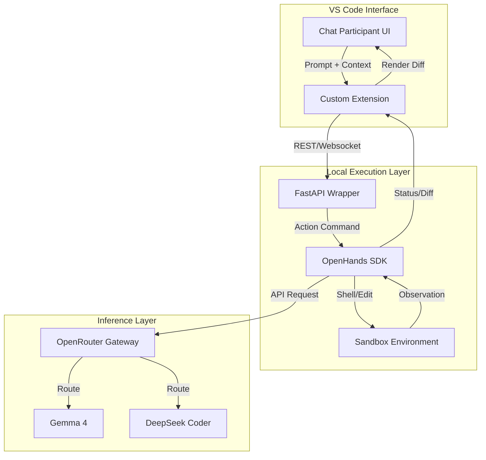

# background-information.md

## Project Overview

The goal of this project is to build a **multi‑agent, supervisor‑orchestrated software‑development factory** using the **OpenHands SDK**, running locally (e.g., inside VS Code) and backed by **OpenRouter** LLMs (such as Gemma 4 and DeepSeek Coder).

This factory will automate the software‑development lifecycle from initial idea to deployment and cleanup, using a **phase‑based pipeline** and a **hierarchical agent architecture**. A top‑level **development‑manager** agent will coordinate a set of specialized phase agents, each responsible for a specific stage of the process and for producing well‑defined artifacts in the repository.

The system will support three operational modes:

- **YOLO mode** — fully autonomous, no user stops.
- **Gated mode** — user chooses which phases require approval.
- **Secure mode** — fixed mandatory checkpoints where user approval is required.

All long‑form artifacts (proposal, specifications, architecture, blueprints, plans, etc.) will be stored as **Markdown files in the `docs/` directory**.

---

## High‑Level Objectives

1. Build a **multi‑phase, agentic software‑development factory** that can be run from within VS Code using the OpenHands runtime.
2. Implement a **supervisor pattern** with a development‑manager agent that:
   - Reads user‑provided background information.
   - Manages phase progression and operational modes.
   - Delegates work to specialized phase agents.
   - Tracks and logs progress.
3. Centralize all human‑readable artifacts in the **`docs/` directory** as Markdown files.
4. Use **OpenRouter** as the LLM backend, with support for:
   - Gemma 4 (planning, analysis, architecture).
   - DeepSeek Coder (code generation, refactoring, blueprinting).
5. Provide a **template repository** that others can fork and use by simply supplying their own OpenRouter API key via GitHub Secrets.

---

## Operational Modes

### YOLO Mode

- The development‑manager automatically advances through all phases.
- No user interaction is required once the process starts.
- Intended for rapid prototyping and fully automated runs.

### Gated Mode

- The user selects which phases are “gated.”
- The development‑manager pauses at those phases and asks the user whether to proceed.
- Useful when the user wants control over specific critical steps.

### Secure Mode

- A fixed set of mandatory checkpoints is enforced.
- The user must explicitly approve continuation at those checkpoints.
- Intended for safety‑critical or high‑risk development scenarios.

---

## Agent Architecture

### Development‑Manager (Supervisor Agent)

The **development‑manager** is the central orchestrator. Its responsibilities include:

- Encouraging the user to write down all their ideas in:
  - `domain-knowledge/background-information.md`
- Waiting for the user to signal that they are done with background input.
- Initiating **Phase 1 (Proposal Development)** by calling the **code‑proposal‑developer** agent.
- Managing the **phase state machine** and tracking which phase is active.
- Enforcing the selected **operational mode** (YOLO, gated, secure).
- Delegating work to the appropriate **phase agent**.
- Writing or ensuring the creation of **Architecture Decision Records (ADRs)** whenever a material architectural or design decision is made in any phase.
- Receiving structured failure reports from phase agents, deciding whether rollback or upstream phase re-entry is required, recording the rollback reason in shared core context, and re-dispatching the selected upstream phase with the failure report attached.
- Writing logs and status updates to the `logs/` directory.
- Ensuring that each phase produces its expected artifacts in the `docs/` and other relevant directories.

### Phase Agents

Each phase has a dedicated agent with:

- A specialized prompt and role description.
- A defined set of tools and skills (e.g., file editing, shell commands, code analysis).
- A clear input/output contract (which files to read, which files to write).
- Access to the shared workspace.

Each phase agent reports back to the development‑manager when its work is complete.

---

## Software‑Development Phases

The factory will implement the following phases:

1. **Proposal Development Phase**  
   - Agent: `proposal_agent`  
   - Input: `domain-knowledge/background-information.md`  
   - Output: `docs/proposal/code-proposal.md`  
   - Description: Convert the user’s background information into a structured code proposal describing the intended software system.

2. **SW Factory Init Phase**  
   - Agent: `factory_init_agent`  
   - Output: Initial repository structure (directories such as `docs/`, `src/`, `tests/`, `logs/`, etc.).  
   - Description: Set up the software factory workspace, ensuring all required directories exist.

3. **Specification Development Phase**  
   - Agent: `specification_agent`  
   - Output: `docs/specifications/software-specification.md`  
   - Description: Produce detailed functional and non‑functional specifications based on the proposal.

4. **SW Architecture Phase**  
   - Agent: `architecture_agent`  
   - Output: `docs/architecture/system-architecture.md`  
   - Description: Define system architecture, modules, interfaces, and data flows.

5. **Code Blueprint Creation Phase**  
   - Agent: `blueprint_agent`  
   - Output: `docs/blueprints/code-blueprint.md`  
   - Description: Generate high‑level code blueprints, scaffolding, and module outlines.

6. **SW Development Plan Creation Phase**  
   - Agent: `dev_plan_agent`  
   - Output: `docs/development-plan/development-plan.md`  
   - Description: Create a development roadmap, milestones, and task breakdown based on the blueprints.

7. **Code Implementation Phase**  
   - Agent: `implementation_agent`  
   - Output: Source code in `src/` and possibly supporting files.  
   - Description: Implement the code according to the blueprints and specifications.

8. **Quality Assurance Testing Phase**  
   - Agent: `qa_agent`  
   - Outputs:
     - `docs/qa/qa-test-plan.md`
     - Test files in `tests/unit/`, `tests/integration/`, and `tests/e2e/`  
   - Description: Design and (optionally) run tests, perform static analysis, and validate behavior.

9. **SW Packaging Phase**  
   - Agent: `packaging_agent`  
   - Outputs:
     - `docs/packaging/packaging-plan.md`
     - Build artifacts in `build/`  
   - Description: Prepare build artifacts, installers, containers, or distribution bundles.

10. **SW Documentation Writing Phase**  
    - Agent: `documentation_agent`  
    - Output: `docs/documentation/documentation-plan.md` and possibly additional documentation files.  
    - Description: Produce user guides, API docs, and developer documentation.

11. **SW Deployment Phase**  
    - Agent: `deployment_agent`  
    - Outputs:
      - `docs/deployment/deployment-plan.md`
      - Deployment scripts in `deployment/`  
    - Description: Deploy the software to the target environment or generate deployment scripts.

12. **SW Factory Clean Up Phase**  
    - Agent: `cleanup_agent`  
    - Outputs:
      - Cleanup actions in the workspace.
      - Final notes in `docs/summary/phase-summary-log.md`  
    - Description: Archive logs, finalize artifacts, and clean temporary files.

---

## Testing Strategy

The factory will support three types of tests, organized under the `tests/` directory:

- **Unit Tests (`tests/unit/`)**
  - Validate individual functions, classes, and modules.
  - Fast, isolated, and deterministic.
  - May use mocks or stubs for external dependencies.

- **Integration Tests (`tests/integration/`)**
  - Validate interactions between multiple modules or components.
  - Ensure that agents, tools, and workspace operations work together correctly.

- **End‑to‑End Tests (`tests/e2e/`)**
  - Validate the entire multi‑phase pipeline.
  - Simulate real user workflows and verify that the development‑manager and phase agents operate correctly as a system.

The **QA agent** (Phase 8) is responsible for designing and/or generating these tests and placing them in the appropriate directories.

---

## LLM Backend (OpenRouter)

The factory will use **OpenRouter** as the LLM provider. The primary models of interest are:

- **Gemma 4**
  - Use cases: planning, analysis, summarization, architecture, high‑level reasoning.
- **DeepSeek Coder**
  - Use cases: code generation, refactoring, blueprinting, implementation details.

A custom LLM provider will:

- Wrap the OpenRouter API.
- Route requests to different models based on task type (e.g., planning vs. coding).
- Allow users to configure models and supply their own `OPENROUTER_API_KEY` via GitHub Secrets or environment variables.

---

## Execution Environment

The factory is intended to run:

- **Locally in VS Code**, using the OpenHands runtime.
- With **Python** as the primary implementation language for agents and orchestration.
- In a **GitHub repository**, with development possibly assisted by GHCP Agent mode.
- With a clear separation between:
  - `factory/` (agent logic, configuration, runtime)
  - `docs/` (artifacts)
  - `src/`, `tests/`, `build/`, `deployment/` (software project outputs)

---

## Repository Structure

The target repository structure is:

```text
/
├── domain-knowledge/
│   └── background-information.md
│
├── docs/
│   ├── proposal/
│   │   └── code-proposal.md
│   │
│   ├── specifications/
│   │   └── software-specification.md
│   │
│   ├── architecture/
│   │   ├── system-architecture.md
│   │   └── decisions/
│   │       └── NNNN-<slug>.md
│   │
│   ├── blueprints/
│   │   └── code-blueprint.md
│   │
│   ├── development-plan/
│   │   └── development-plan.md
│   │
│   ├── qa/
│   │   └── qa-test-plan.md
│   │
│   ├── packaging/
│   │   └── packaging-plan.md
│   │
│   ├── documentation/
│   │   └── documentation-plan.md
│   │
│   ├── deployment/
│   │   └── deployment-plan.md
│   │
│   └── summary/
│       └── phase-summary-log.md
│
├── src/
│   └── (source code generated in Phase 7)
│
├── tests/
│   ├── unit/
│   │   └── (unit test files)
│   │
│   ├── integration/
│   │   └── (integration test files)
│   │
│   └── e2e/
│       └── (end-to-end test files)
│
├── build/
│   └── (build artifacts from Phase 9)
│
├── deployment/
│   └── (deployment scripts from Phase 11)
│
├── logs/
│   └── (agent logs, phase logs, execution traces)
│
├── factory/
│   ├── agents/
│   │   ├── development_manager.py
│   │   ├── proposal_agent.py
│   │   ├── factory_init_agent.py
│   │   ├── specification_agent.py
│   │   ├── architecture_agent.py
│   │   ├── blueprint_agent.py
│   │   ├── dev_plan_agent.py
│   │   ├── implementation_agent.py
│   │   ├── qa_agent.py
│   │   ├── packaging_agent.py
│   │   ├── documentation_agent.py
│   │   ├── deployment_agent.py
│   │   └── cleanup_agent.py
│   │
│   ├── llm/
│   │   ├── openrouter_provider.py
│   │   └── model_routing.py
│   │
│   ├── config/
│   │   ├── modes.yaml
│   │   ├── phases.yaml
│   │   └── agent_prompts/
│   │       └── (prompt files for each agent)
│   │
│   └── runtime/
│       ├── run_factory.py
│       └── state_machine.py
│
└── README.md
```

---

## Custom Agent Architecture

Building a custom agent with **OpenHands** and **OpenRouter** allows you to move beyond the constraints of generic tools and create a system capable of autonomous, hardware-aware reasoning.

### Architecture Components

* **Tier 1: The Orchestration SDK (OpenHands)**: Acts as the "Agent Core" that manages the event stream, translating goals into shell commands or file edits. You can define custom runtimes here to include your specialized physics libraries.
* **Tier 2: The Model API (OpenRouter)**: Serves as the "Reasoning Engine". It uses **Gemma 4** for low-latency tasks and **DeepSeek Coder** for complex architectural logic.
* **Tier 3: The UI Extension (VS Code Chat Participant)**: The "Interaction Layer" that integrates with the vscode.chat.createChatParticipant API. It forwards prompts to the local OpenHands service and streams diffs back to your IDE.

### Integration Logic

1. **SDK Layer**: Initialize OpenHands in a Dockerized runtime and configure it to use OpenRouter endpoints via LLM_CONFIG.
2. **API Layer**: Expose a FastAPI wrapper on localhost to trigger OpenHands tasks via its Action API.
3. **VS Code Layer**: Create a thin-client extension that captures workspace context, sends it to your API, and renders suggestions as native VS Code diffs.

### System Connectivity Diagram



### The Advantage

This setup enables you to bypass generic agent limitations by allowing **OpenHands** to interact directly with your custom build harnesses. Using **OpenRouter** ensures you can dynamically select the most efficient model for hardware-level optimizations or systemic governance.

---

## Anvil Ground Truth Decisions (Authoritative)

This section records the authoritative intent for **Anvil** and should be treated as the primary source of truth for proposal, specification, architecture, and implementation decisions.

### Product Identity and Intent

- Agent name (canonical): **Anvil**.
- Mission: Build a coding agent with full harness control so instructions, architecture patterns, model usage, and coding behavior are explicitly governed.
- Primary design goals:
  - Very high instruction precision.
  - Strong token efficiency.
  - Strict model selection/routing controls.
  - High reliability for large-scale autonomous coding.
- Strategic goal after v0.1.0: Use Anvil to implement additional parts of Anvil itself (bootstrapping/dogfooding).

### Intended Users

- Primary user: repository owner.
- Secondary users: team developers.
- Programmatic users: swarm/orchestrator systems (for example, OpenClaw-like systems) that need a reliable, token-efficient coding sub-agent.

### v0.1.0 Success Criteria

- End-to-end operation should work reliably in a practical v0.1.0 form.
- The system should support full lifecycle generation from background input through implementation and quality checks.
- Self-healing should handle most failures with minimal escalations.
- Ambition target: ability to originate very large codebases (on the order of 100k LOC) with relatively few human interventions.

### Scope and Non-Goals for v0.1.0

- Must be delivered as its own VS Code extension.
- Must run locally.
- Must not require running inside GHCP.
- Fine-tuning and model training are out of scope.
- Generated-code language support target: **Python, Rust, and C**.

### Execution Model and Runtime Constraints

- Primary platforms for v0.1.0: **Linux and WSL**.
- Python baseline: **3.12**.
- Internet access is assumed available during runs.
- Docker policy for v0.1.0: **required by default** for execution isolation and reproducibility.

### Failure Handling and Escalation

- Self-healing first: automatic retries and correction attempts should be standard behavior.
- Structured failure reports from phase agents must be first-class inputs to the manager's recovery logic.
- When a failure report identifies an upstream defect, invalid assumption, or architectural inconsistency, the manager must select the appropriate upstream phase to re-enter, persist the rollback reason in shared core context, and re-dispatch that phase with the failure report attached.
- Human escalation only when self-healing is not converging.
- Escalations should be clear, concise, and actionable.

### Architectural Decision Records

- The system must create an ADR whenever a material architectural or design decision is made, regardless of which phase produces the decision.
- ADRs must be stored in `docs/architecture/decisions/` using one decision per file.
- ADR filenames must follow the pattern `NNNN-<slug>.md` with monotonic numbering.
- Each ADR must use a standard structure containing at least: context, decision, consequences, and alternatives considered.
- ADRs are the durable record of why the system is shaped the way it is and must be available as input to later phases, rollback analysis, and future maintenance.

### State Persistence and Resume Behavior

- On restart after interruption/crash, resume automatically from the last completed phase.
- Manual override must allow starting from a user-selected phase.

### Operational Concurrency

- Concurrency is desired wherever dependencies permit.
- Pipeline should behave like a dependency-aware DAG rather than a strictly linear flow.
- Independent workstreams (for example, unrelated testing and documentation work) may proceed in parallel.

### Model Routing Strategy

- Routing approach: **both fixed defaults per phase and user-configurable overrides**.
- Initial core models: Gemma 4 and DeepSeek Coder.
- System must be extensible to add additional low-cost models.
- Candidate low-cost additions to keep available in routing config:
  - Google Gemini Flash family
  - Mistral Codestral
  - Llama 3.x small instruct variants

### Inter-Agent Communication (v0.1.0 and Beyond)

- v0.1.0 recommendation: in-process agent invocation with strict contracts for simplicity and reliability.
- Future direction: evolve transport to a message queue/event bus without changing agent contracts.
- **A2A peer transport is explicitly out of scope for v0.1.0.** Agent contracts must be designed transport-agnostic so A2A can be added in a future release without reworking business logic. Programmatic/orchestrator callers are served by the localhost REST API in v0.1.0.

### UX and Control Surface

- Entry points should support both:
  - VS Code command palette/actions.
  - Chat-style command invocation.
- UX should remain close to known good patterns (Claude-like familiarity) and avoid novel complexity without clear benefit.

### Policy Governance and Behavior Shaping

- v0.1.0 must include all three:
  - Central policy files.
  - Validation gates that fail non-compliant outputs.
  - Auto-rewrite/remediation pass before escalation.
- Behavior-shaping assets should live in a hidden user-root directory using agent naming convention.
- For Anvil, this root is **.anvil**.
- Structure should mirror familiar agent ecosystems (for example: agents, skills, MCP-like integration layout).

### Security and Secrets

- Mandatory controls for v0.1.0:
  - Store OpenRouter key in VS Code Secret Storage.
  - Allow environment variable fallback (`OPENROUTER_API_KEY`) for headless/CI scenarios.
  - Redact secrets from logs and escalation output.
- Network policy direction:
  - Secure-by-default with configurable profiles (for example: open, restricted, strict).
  - Start with a practical allowlist approach rather than blanket blocking.

### Configuration Precedence (Highest to Lowest)

1. Run-time flags/overrides.
2. Workspace-local configuration.
3. User-root defaults (for example, `.anvil`).
4. Extension built-in defaults.

---

## Anvil Integration Details (Hooks, Events, Skills, MCP)

This section defines how Anvil should integrate OpenHands SDK extension points in v0.1.0.

### Design Principles

- Keep user intent and policy in the user-root Anvil home (`~/.anvil`).
- Materialize OpenHands-compatible runtime config inside the active workspace only when a run starts.
- Prefer deterministic, policy-driven behavior over ad-hoc prompt-only behavior.
- Preserve compatibility with OpenHands native paths and contracts to reduce maintenance risk.

### Directory Mapping

Canonical Anvil home:

```text
~/.anvil/
├── agents/
├── skills/
├── mcp/
│   ├── servers.json
│   └── allowlists/
├── hooks/
│   ├── hooks.json
│   └── scripts/
├── policies/
│   ├── coding-standards.yaml
│   ├── architecture-rules.yaml
│   ├── model-routing.yaml
│   └── security-policy.yaml
└── runtime/
    └── defaults.yaml
```

Per-workspace runtime projection (generated per run):

```text
<workspace>/
├── .agents/skills/                  # Workspace skill overlays
└── .openhands/
    ├── hooks.json                   # OpenHands-compatible hook config
    └── runtime/
        ├── mcp.generated.json       # Resolved MCP server config for this run
        └── policy-snapshot.json      # Effective merged policy snapshot
```

### Hooks Integration

- OpenHands hook execution contract in v0.1.0:
  - Load workspace hooks from `.openhands/hooks.json`.
  - Use typed hook events: `PreToolUse`, `PostToolUse`, `UserPromptSubmit`, `SessionStart`, `SessionEnd`, `Stop`.
- Blocking semantics:
  - Exit code `2` means block/deny.
  - Any other non-zero exit code is a non-blocking error.
- Anvil behavior:
  - Source-of-truth hook definitions live in `~/.anvil/hooks/hooks.json` plus workspace overrides.
  - On run start, Anvil compiles and writes effective hooks to `<workspace>/.openhands/hooks.json`.
  - Policy violations first trigger auto-rewrite/remediation when possible.
  - If remediation fails after bounded retries, escalate to user.

Recommended baseline hooks for v0.1.0:

- `PreToolUse`: block dangerous commands and blocked network destinations.
- `PostToolUse`: structured audit logging for tool actions and outcomes.
- `UserPromptSubmit`: inject concise, policy-relevant context (avoid token bloat).
- `Stop`: enforce completion criteria (required artifacts/tests/status) before allowing finish.

### Custom Event Integration

- Anvil should use OpenHands events as the core observability stream.
- v0.1.0 event categories to consume and persist:
  - conversation state updates
  - action/observation and message events
  - hook execution events
  - token/cost and LLM completion log events
- Anvil-specific telemetry should be represented using one of two paths:
  - Lightweight path: external structured telemetry file in workspace logs.
  - First-class path: custom SDK Event subclass when the event must be queryable in native event APIs.

v0.1.0 requirement:

- Every escalation must include references to the underlying event IDs and phase context.

### Skills Integration

- Skills must be progressive-disclosure first to preserve token efficiency.
- Loading/precedence behavior should align with agreed precedence model:
  1. Run-time overrides
  2. Workspace-local skill/config overlays
  3. User defaults from `~/.anvil`
  4. Built-in extension defaults
- Workspace compatibility:
  - Materialize workspace-visible skills in `.agents/skills/` for active project context.
  - Keep user-global reusable skills in `~/.anvil/skills/`.
- Skill format support for v0.1.0:
  - AgentSkills-style `SKILL.md`
  - Trigger-driven knowledge skills
  - Always-on repo skills kept minimal and tightly scoped

Skill governance requirements:

- Skill activation must respect policy allowlists for tools.
- Inline command execution in skill content is allowed only for trusted skills.
- Public/marketplace skills must be explicitly enabled and pin-able by source/ref.

### MCP Tool Integration

- MCP servers are declared in Anvil config and resolved per run into a generated runtime MCP config.
- MCP tool registration is policy-gated:
  - allow by server
  - allow by tool name/pattern
  - deny by default in restricted/strict profiles when unspecified
- Security profiles:
  - `open`: broad MCP/tool access
  - `restricted`: approved servers/tools only
  - `strict`: minimal required MCP capability, no optional servers

v0.1.0 MCP reliability requirements:

- bounded timeout when listing/connecting MCP tools
- deterministic failure handling with self-heal attempt first
- escalation with actionable diagnostics when MCP handshake/tool listing fails

### Run Lifecycle for Integration Points

At run start:

1. Resolve effective config from defaults, user root, workspace overrides, and run-time flags.
2. Generate workspace runtime projection (`.openhands/hooks.json`, runtime MCP config, policy snapshot).
3. Initialize agent with hooks, skill context, and MCP config.

During run:

1. Enforce hooks at lifecycle boundaries.
2. Emit and persist event stream plus Anvil telemetry.
3. Apply remediation loops before escalation.

At run end:

1. Emit final state summary with event references.
2. Persist resume checkpoint for last completed phase.
3. Retain artifacts/logs needed for restart and postmortem review.

### v0.1.0 Non-Negotiable Acceptance Criteria for These Extensions

- Hooks can block unsafe actions deterministically via policy.
- Skills load with precedence and remain token-efficient in normal operation.
- MCP tools are discoverable, filtered, and governed by profile.
- Event trail is sufficient to explain every escalation and final outcome.
